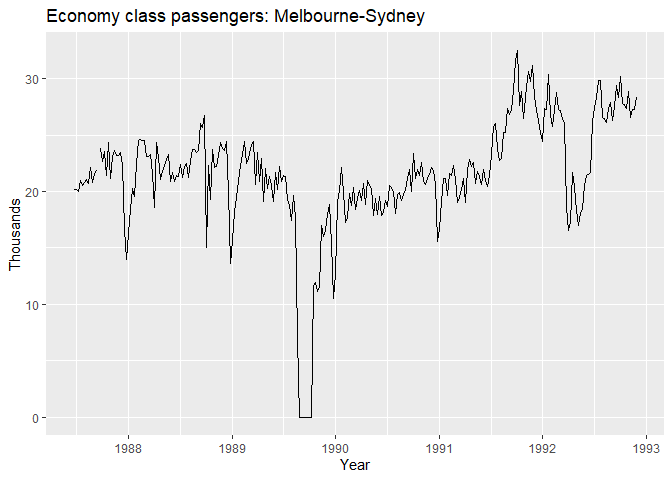
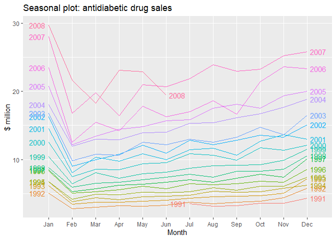

## ¿Qué se puede pronosticar?

Hay muchos fenómenos o variables que se pueden pronosticar; p. ej. los insumos que va a requerir una planta el siguiente mes o semana, las ventas de cierta sucursal en el mediano o largo plazo, la demanda de energia para una region del pais en las siguientes 24 horas, etc.

Asi, podemos necesitar pronosticos para muy corto plazo (minutos, horas,...), diarios, semanales, mensuales, hasta de largo plazo (para los siguientes 5, 10 años).

Es importante saber que existen variables que se pueden pronosticar con gran exactitud (p. ej., la puesta del sol el dia de mañana, o el siguiente eclipse lunar), y otras que, por mas que intentemos, nuestro pronostico sera un mero experimento aleatorio (pronosticar los numeros ganadores de la rifa del avion presidencial, *donde ni siquiera te ganas el mentado TP-01*).

Entonces, que tan predecible es una variable o fenomeno depende de varias cosas:

1. Que tan bien conocemos los factores o elementos que influyen en el.
2. Que tantos datos tenemos disponibles.
3. Si el pronostico que vamos a realizar puede influir en el resultado de la variable a predecir.

Un caso de un tipo de series que son dificiles de pronosticar, son los tipos de cambio. Estos solo cumplen una de las tres caracteristicas: tenemos muchos datos disponibles de ellos. Pero, desafortunadamente, hasta el momento no conocemos bien todo lo que afecta al tipo de cambio. Aparte, si se realiza algun pronostico de que, por ejemplo, el tipo de cambio va a aumentar, este puede influir en el valor futuro del mismo, logrando una *"profecia autocumplida"*. Esto es:

* Debido a las leyes de la oferta y la demanda, y a las nuevas expectativas de la gente a que va a subir el precio del dolar, la gente precavida comenzara a comprar dolares mientras estan "baratos".
* Esta nueva demanda ejercera presion en el tipo de cambio y comenzara a aumentar.
* Al ver esto las demas personas, veran que se esta cumpliendo el pronostico y querran adquirir mas dolares, antes de que suba tanto el precio.
* Esto podria provocar un efecto de bola de nieve y presionar mas el tipo de cambio.

Un buen pronostico captura los patrones genuinos de la variable y las relaciones existentes en los datos historicos, pero **no replica** eventos pasados que no volveran a suceder. Otra cualidad de un buen modelo de pronostico es aquel que captura la forma en que las cosas estan cambiando.

## Pronosticos, planeacion y metas

En los negocios, realizar pronosticos es una tarea estadistica muy comun; p. ej.

* Las plantas ensambladoras requieren realizar pronosticos de la demanda, para agendar la cantidad de obreros a requerir por turno.

* Una sucursal de carniceria debe prever cuantos kilogramos de carne se van a demandar al dia siguiente, para no quedarse sin existencias, ni con demasiados sobrantes.

* Una empresa de outsourcing de call center debe pronosticar la cantidad de llamadas que recibira, para habilitar ejecutivos de atencion a clientes suficientes.

* etc.

Sin embargo, los pronosticos de negocios a menudo se realizan muy deficientemente y son confundidos con la planeacion y las metas de la empresa.

* Los **pronosticos** se tratan de predecir el futuro de la manera mas certera posible, dada la informacion disponible, incluyendo datos historicos y conocimiento de eventos futuros que puedan impactar el pronostico.

* Los **objetivos** es lo que la empresa quiere que suceda (p. ej. crecer las ventas el 80%, *YOY*). Los objetivos o metas deberian estar ligados al pronostico, pero no siempre suceden. Seguido las metas se establecen sin ningun plan para como lograrlo o sin un pronostico de si son asequibles o no.

* La **planeacion** es la respuesta a los pronosticos y metas. Involucra llevar a cabo las acciones necesarias para que los pronosticos igualen a las metas.

Depende de la aplicacion especifica, pero las empresas necesitan pronosticos de corto, mediano y largo plazo.

* Los pronosticos de **corto plazo** se requieren para la programacion de personal, produccion y transporte, principalmente. Para ello, pronosticos de la demanda son requeridos de igual manera.

* Los pronosticos de **mediano plazo** se utilizan para determinar los requerimientos futuros de recursos, para poder adquirir materia prima, contratacion de personal, compra de maquinaria y equipo, etc.

* Los pronosticos de **largo plazo** son utilizados en la *planeacion estrategica*. Tales decisiones deben tomar en cuenta oportunidades de mercado y factores internos y externos de la empresa.

## Los pasos para llevar a cabo un pronostico

1. **La definicion del problema**. Se necesita tener un buen entendimiento del modo en que se usara el pronostico, quien lo va a consumir y como encaja dentro de la organizacion.

2. **Recopilacion de informacion**. Por lo general se requieren dos tipo de informacion: datos estadisticos y el *expertise* acumulado de la gente que recopila la informacion y usa los pronosticos.

3. **Analisis exploratorio de los datos**. Siempre se debe comenzar graficando los datos. ¿Se muestran patrones relevantes?, ¿existe una tendencia significativa?, ¿la estacionalidad es importante?, ¿existe evidencia de ciclos de negocio?, ¿hay datos *outliers* que se requieran explicar?

4. **Seleccion y estimacion de modelos**. La seleccion del modelo dependera de la disponibilidad de la informacion y del uso que se le dara al pronostico. Es comun comparar entre dos o tres modelos potenciales.

5. **Uso y evaluacion del modelo de pronostico**. Una vez seleccionado el modelo y estimado sus parametros, se realiza el pronostico. La evaluacion del desempenio del modelo solo se puede evaluar hasta que se obtiene la informacion real del periodo pronosticado.

## El analisis de series de tiempo

Para el analisis de series de tiempo, lo primero que se debe tener es la serie limpia. Una vez teniendo los datos listos para trabajar, la primera parte del analisis es visual: **debemos graficar la o las serie(s)**.

Los graficos nos permiten observar patrones, relaciones entre variables, cambios en el tiempo, valores inusuales, etc.

En **R**, podemos tener objetos de series de tiempo, `ts`. Por ejemplo, tomemos la siguiente tabla de datos anuales:


  Año   Observación
-----  ------------
 2012           119
 2013            41
 2014            92
 2015            48
 2016           115
 2017            33
 2018            27
 2019            87
 2020           103

Para convertirla en un objeto `ts`, utilizamos la siguiente funcion.


```r
(y <- ts(c(119, 41, 92, 48, 115, 33, 27, 87, 103),start = 2012))
```

```
## Time Series:
## Start = 2012 
## End = 2020 
## Frequency = 1 
## [1] 119  41  92  48 115  33  27  87 103
```

Observando el resultado, vemos que **R** en automatico detecto el inicio, 2012, y fin de la serie, 2020. Adicionalmente, nos imprimio el argumento de `frequency`. La **frecuencia** de una serie de tiempo es el numero de observaciones que existen antes de que se repita el patron estacional.

Para datos anuales, la frecuencia es 1, normalmente. Para trimestrales, 4; mensuales, 12; semanales, 52.

### Graficas de tiempo

En estos graficos, el eje x siempre sera el tiempo, y la variable de interes se grafica en el eje y.


```r
library("tidyverse")
library("fpp2")
```

```r
autoplot(melsyd[,"Economy.Class"])+
  ggtitle("Economy class passengers: Melbourne-Sydney")+
  xlab("Year")+
  ylab("Thousands")
```

<!-- -->

La funcion `autoplot` es de la paqueteria `forecast` y genera, de manera automatica, una grafica con `ggplot2`, de acuerdo a los datos introducidos.

Los datos se encuentran dentro de la paqueteria `fpp2`. Con una exploracion rapida, vemos lo siguiente:


```r
glimpse(melsyd)
```

```
##  Time-Series [1:283, 1:3] from 1987 to 1993: 1.91 1.85 1.86 2.14 2.12 ...
##  - attr(*, "dimnames")=List of 2
##   ..$ : NULL
##   ..$ : chr [1:3] "First.Class" "Business.Class" "Economy.Class"
```

Son tres series de tiempo, de 1987 a 1993, especificando la cantidad de pasajeros en aviones de Melbourne a Sidney (Australia). *Nota:* Siempre podemos acudir al comando `help()` para ver mas informacion al respecto.

Esta grafica muestra varias caracteristicas sobre la serie:

* En 1989, hay un periodo en donde no hubo pasajeros.
    - Esto se debio a una huelga del personal aereo.
* En 1992, hubo un tiempo en que se redujo la cantidad de pasajeros de clase turista.
    - Esto fue gracias a que hicieron una prueba y reemplazaron lugares de clase turista por *business class*.
* Hubo un aumento considerable de pasajeros en el segundo semestre de 1991.
* Se ve una  caida en los pasajeros al inicio de cada anio.
    - Esto es provocado por los efectos de los dias feriados.
* Hay fluctuaciones de largo plazo en el nivel de la serie: incrementa en 1987, disminuye en 1989, y vuelve a aumentar en 1990 y 1991.
* Hay periodos con valores omitidos (*missing values*).

Cualquier modelo que intentemos ajustar a esta serie necesita tomar en consideracion todo esto para poder predecir de manera precisa la carga de pasajeros en el futuro.

------------------------
Podemos analizar una serie de tiempo mas sencilla, como la `a10`, del mismo paquete `fpp2`.


```r
autoplot(a10) +
  ggtitle("Antidiabetic drug sales") + 
  ylab("$ million") + 
  xlab("Year")
```

<!-- -->

En esta grafica se muestra claramente una tendencia incremental. Tambien podemos ver un patron estacional bien marcado, que aumenta conforme el nivel de la serie incrementa.

La caida brusca a inicios de cada anio se debe a un subsidio que otorga el gobierno a finales de cada anio; por lo tanto, se sobre abastecen al final y dejan de comprar a inicios. Cualquier modelo que se ajuste a esta serie debe capturar el efecto estacional y el hecho de que la tendencia esta cambiando lentamente.

### Patrones en las series de tiempo

Una serie de tiempo puede estar conformada por ciertos componentes, como una *tendencia*, un componente *estacional*, y un componente *ciclico*.

La **tendencia** existe en una serie de tiempo, cuando hay un incremento o decremento de largo plazo en los datos. Puede ser lineal o no lineal.

Una serie de tiempo tiene un componente **estacional** cuando se ve afectada por factores como la temporada del anio o el dia de la semana. La estacionalidad es de una frecuencia fija.

El componente **ciclico** ocurre cuando hay picos (a la alza o baja), que no tienen una frecuencia fija. Es comun que se deban a condiciones economicas y se les conoce como *ciclos economicos*.

Por lo general, el largo del componente ciclico y su magnitud son mayores que las del estacional.

Para hacer pronosticos, primero se debe identificar si la serie en cuestion presenta uno o mas de estos componentes.

### Graficas estacionales

Son similares a los graficos de tiempo, solo que en estas los datos se grafican contra las estaciones individuales.


```r
ggseasonplot(a10, year.labels=TRUE, year.labels.left=TRUE) + 
  ylab("$ million") + 
  ggtitle("Seasonal plot: antidiabetic drug sales") 
```

<!-- -->


