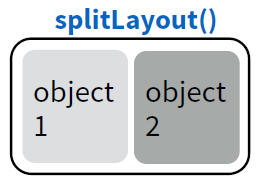
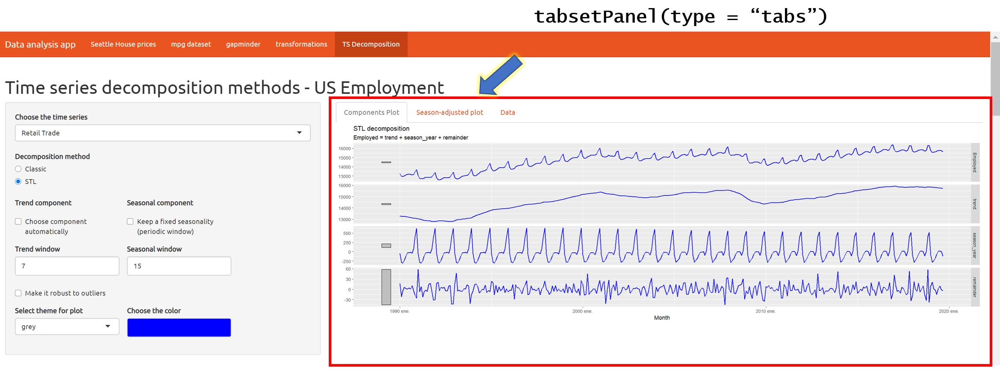
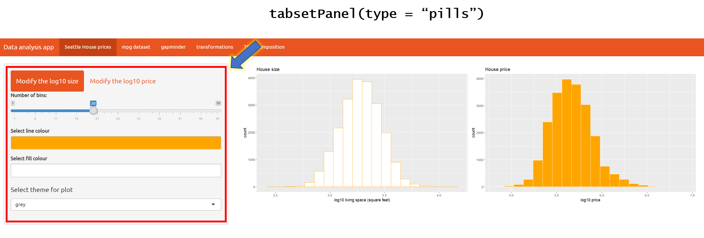
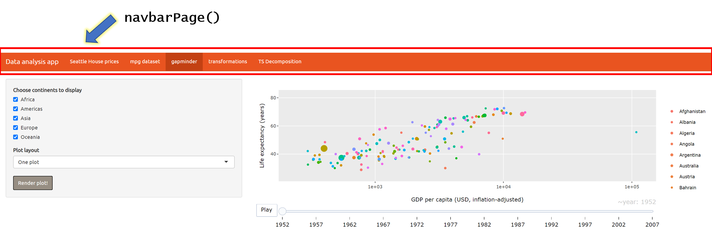
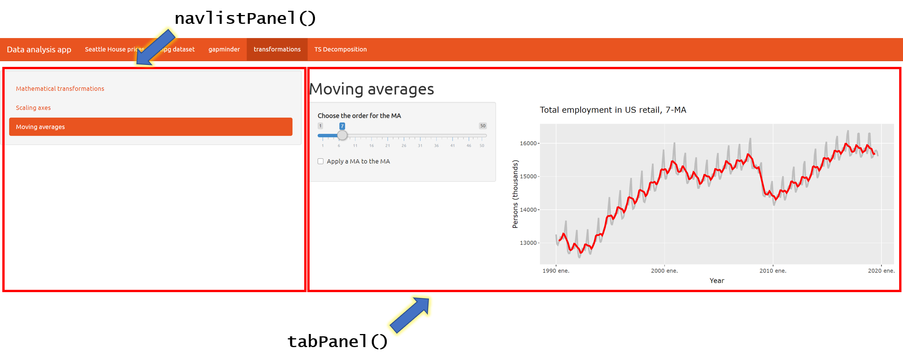

```{r setup, include=FALSE}
knitr::opts_chunk$set(eval = FALSE)
```


# La estructura básica

Toda aplicación que creemos en shiny consta de al menos:

* Una interfaz gráfica, **UI**.

* Una función de servidor, **SERVER**.

* La introducción de una función para correr la app, `shinyApp()`.


```{r shiny-snippet, eval = FALSE}
library(shiny)

# Define UI for application
ui <- fluidPage(

)

# Define server logic required
server <- function(input, output) {


}

# Run the application 
shinyApp(ui = ui, server = server)

```

Dentro de cualquier *shiny app* se puede dar clic al botón **"Run app"**


# Personalización de la interfaz gráfica (`ui`)

## Colocación de elementos dentro de la página {.tabset}

Existen muchos tipos de formatos que se pueden utilizar y todas estas formas de estructurar las páginas se pueden combinar unas con otras en un sinfín de posibilidades.

### Diseño de barra lateral, `sidebarLayout`

La función `sidebarLayout(sidebarPanel, mainPanel, position = c("left", "right"))` nos permite crear una app que contenga una barra secundaria por un lado (**izq.** o der.), y un panel principal. Para esto, especificamos dentro de esta función las funciones `sidebarPanel()` y `mainPanel()`, respectivamente.

Cada panel puede contener uno o más objetos.

```{r sidebarLayout}
ui <- fluidPage(
  # Panel de título
  titlePanel("Título de la app"),
  
  # Especificación de la separación entre panel lateral y principal
  sidebarLayout(
    
    # Panel lateral
    sidebarPanel("Título del panel"),
    
    # Panel principal
    mainPanel("Título del main panel")
    )
)
```


### Filas de objetos, `fluidRow`

Si se desean acomodar objetos por filas, se puede utilizar el formato `fluidRow()`, donde se especifican **columnas** con `column()`, y lo que cada una contendrá.

El ancho de cada columna se especifica con un número del **1 al 12**. Preferentemente, la suma de todas las columnas debería ser **12**.

```{r fluidRow}
ui <- fluidPage(
  # Panel de título
  titlePanel("Título de la app"),
  
  # Primera fila
  fluidRow(
    column(width = 12,
           "objeto de la columna única")
  ),
  # Segunda fila
  fluidRow(
    column(width = 2,
           "objetos de la col. 1"),
    column(width = 5,
           "objetos de la col. 2"),
    column(width = 5,
           "objetos de la col. 3")
  )
)
```


### Diseño de objetos fluidos, `flowLayout`

Si se quieren acomodar varios objetos de forma consecutiva (de izquierda a derecha) y que éstos vayan tomando distintas filas, dependiendo del tamaño de la ventana, se puede utilizar `flowLayout`.

```{r flowLayout}
ui <- fluidPage(
  # Panel de título
  titlePanel("Título de la app"),
  
  flowLayout(
    "objeto 1",
    
    "objeto 2",
    
    "objeto 3",
    
    "etc."
  )
)
```


### Objetos horizontalmente, `splitLayout`

Esta estructura asigna el mismo tamaño a todos los objetos (al menos de manera predeterminada), y los acomoda de manera horizontal. Aquí no son fluidos. Su tamaño cambiará para ajustarse al tamaño de la ventana, pero siempre mantendrán su acomodo.

```{r splitLayout}
ui <- fluidPage(
  # Panel de título
  titlePanel("Título de la app"),
  
  splitLayout(
    "objeto 1",
    
    "objeto 2",
    
    "objeto 3",
    
    "etc."
  )
)
```



### Objetos verticalmente, `verticalLayout`
Si se desean acomodar objetos acomodados de manera vertical entre sí, se puede utilizar esta estructura.

```{r vericalLayout}
ui <- fluidPage(
  # Panel de título
  titlePanel("Título de la app"),
  
  verticalLayout(
    "objeto 1",
    
    "objeto 2",
    
    "objeto 3",
    
    "etc."
  )
)
```


***

## Agregar capas de objetos con `tabPanels` {.tabset .tabset-pills}

Independientemente del tipo de presentación de las capas que se seleccione, cada capa debe ir especificada con `tabPanel()`. 

### Panel con pestañas, `tabsetPanel`

Estos `tabPanels` pueden ser de dos tipos: **pestañas `tabs`** (defáult) y píldoras `pills`.

#### `tabs`

```{r tabsetPanel-tabs}
ui <- fluidPage(
  # Panel de título
  titlePanel("Título de la app"),
  
  tabsetPanel(type = "tabs",
    
    tabPanel("Panel 1",
             ...
             ),
    
    tabPanel("Panel 2",
             ...
             ),
    
    tabPanel("Panel 3",
             ...
             )
  )
)
```



#### `pills`

El código es casi igual, solo cambia el argumento `type = "pills"`.





### Página con barra de navegación, `navbarPage`

Este formato crea una barra de navegación con botones para ls distintos `tabPanels`:

```{r navbarPage}
ui <- fluidPage(
  # Panel de título
  titlePanel("Título de la app"),
  
  navbarPage("Título de la barra",
    
    tabPanel("Panel 1",
             ...
             ),
    
    tabPanel("Panel 2",
             ...
             ),
    
    tabPanel("Panel 3",
             ...
             )
  )
)
```




### Panel con lista de navegación, `navlistPanel`

Se puede crear una lista de navegación, que incluya varios paneles para mostrar distinta información.

```{r navlistPanel}
ui <- fluidPage(
  # Panel de título
  titlePanel("Título de la app"),
  
  navlistPanel(
    
    tabPanel("Panel 1",
             ...
             ),
    
    tabPanel("Panel 2",
             ...
             ),
    
    tabPanel("Panel 3",
             ...
             )
  )
)
```



### {-}

## Funciones `HTML`

Las shiny apps, al igual que los R Notebooks o R Markdown funcionan a base de HTML, por lo que se pueden utilizar funciones sin mayor problema.

Algunas de estas son:

* `h#()` para distintos niveles de encabezados.

* `p()` para generar párrafos.

* `strong()` para poner texto en **negritas**.

* `em()` genera texto en *cursiva*.

* `code()` pone texto en formato de `código`.

```{r, eval=FALSE}
ui <- fluidPage(
    titlePanel("Título de la app"),
    sidebarLayout(
        sidebarPanel("sidebar panel"),
        mainPanel("main panel",
                  h1("encabezado nivel 1"),
                  h2("encabezado nivel 2"),
                  h3("encabezado nivel 3"),
                  p("Inicia párrafo con texto normal,", 
                    strong("texto en negritas dentro del párrafo,"),
                    em("también texto en cursiva"), "y",
                    code("texto con formato de código")),
                  p("Un nuevo párrafo."))
    )
)
```

## Temas

La paquetería `shinythemes` cuenta con varios temas preinstalados que se pueden agregar fácilmente a la app. Para utilizarlos, basta con mandar llamar la librería y, dentro de la interfaz de usuario definir `theme = shinytheme("tema escogido")`, para que su app se muestre así. Pueden ver una lista de los temas soportados actuales [aquí](https://bootswatch.com/3/). Por ejemplo:


```{r shinythemes}
shinyUI(navbarPage(title = "Data analysis app",
                   
                   theme = shinytheme("united"),
                   
                   tabPanel("Seattle House prices",
                   )
)
)
```

## Más personalización con HTML y CSS

Si están familiarizados con HTML y CSS, se puede personalizar cuanto quieran su aplicación o partes de ella.

P. ej., se puede agregar un archivo con todas las características CSS. Para esto, se necesita poner en una carpeta (*dentro del directorio de la app*) que lleve por nombre "**www**" y para cargar el tema, se haría de manera similar que con los `shinythemes`. Asumiendo que su archivo CSS se llama "bootstrap.css", se podría cargar así:

```{r css}
shinyUI(navbarPage(title = "Data analysis app",
                   
                   theme = "bootstrap.css",
                   
                   tabPanel("Seattle House prices",
                   )
)
)
```

## Carga de imágenes

Se pueden incluir imágenes dentro de la app, como logotipos, fondos, etc. Los archivos deben estar guardados también en la carpeta "**wwww**" para que **R** pueda encontrarlos.

La imagen se puede definir dentro de cualquier tipo de interfaz seleccionada con la función `img()`.

```{r img}
img(src = "image.jpg", 
                height = "70%", width = "70%", align = "center")
```


# Objetos en shiny

Hasta ahora solo hemos visto cómo se puede personalizar la app. Sin embargo, no hemos agregado ningún objeto con el que el usuario pueda interactuar (`inputs`) o visualizar después de su interacción (`outputs`).


## Entradas del usuario, `inputs`

Existen muchos tipos de objeto, creados para que el usuario pueda interactuar con la app. Todos estos `inputs` se definen dentro de la interfaz de usuario, `ui`.

Entre ellos:

* Botones de acción, `actionButton()`

* Casillas de verificación:
  - múltiples, `checkboxGroupInput()`
  - sencillas, `checkboxInput()`

* Selectores de fecha:
  - una fecha en particular, `dateInput()`
  - un rango de fechas, `dateRangeInput()`
  
* Carga de archivos, `fileInput()`

* Valores numéricos, `numericInput()`

* Botones de radio, `radioButtons()`

* Listas desplegables, `selectInput()`

* Barra deslizante, `sliderInput()`

* Botón de enviar, `submitButton()`

* Entradas de texto, `textInput()`

* Selección de colores, `colourInput()` * *disponible con la paquetería* `colourpicker`.

Cada uno de estos objetos de input debe tener su propio identificador **único**, `inputId`, que, de hecho, es el primer argumento de cada función. Con este ID mandaremos llamar las entradas del usuario para modificar los resultados en la parte del servidor (`server`).

## Respuesta de la app, `outputs`

Para poder mostrar gráficas, tablas, texto, etc. una vez que el usuario interactuó con los `inputs`, es necesario definir (todavía dentro de la `ui`) el  tipo de `output` que queremos mostrar.

Estas funciones de `output` van acompañadas de una función similar en la parte del servidor. Debajo se muestran varias funciones comunes, junto con su par para la parte del servidor.


| Función de la `ui` | Descripción | Función del `server`  |
|:------------------:|:-----------:|:---------------------:|
| `plotOutput()`| Gráfica estática | `renderPlot()`        |
| `plotlyOutput()`|Gráfica interactiva | `renderPlotly()`  |
| `tableOutput()` | Tabla de datos | `renderTable()`       |
| `dataTableOutput()`|Tabla interactiva|`renderDataTable()`|
| `textOutput()` | Texto con formato | `renderText()`      |
| `verbatimTextOutput()`|Texto de consola | `renderPrint()`|
| `imageOutput()`    | Imagen      | `renderImage()`       |


# Configuración del servidor, `server`


