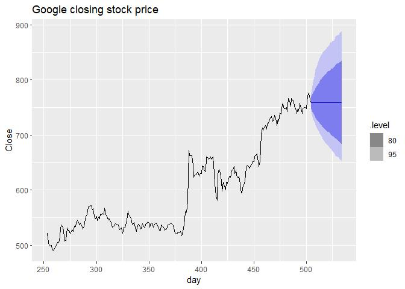
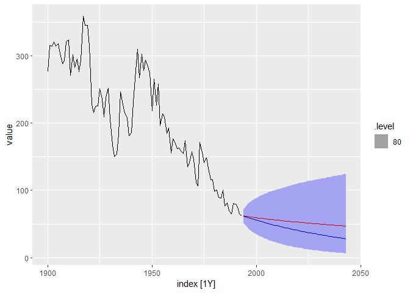
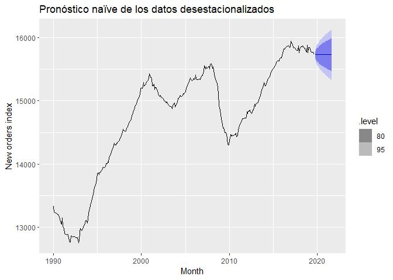
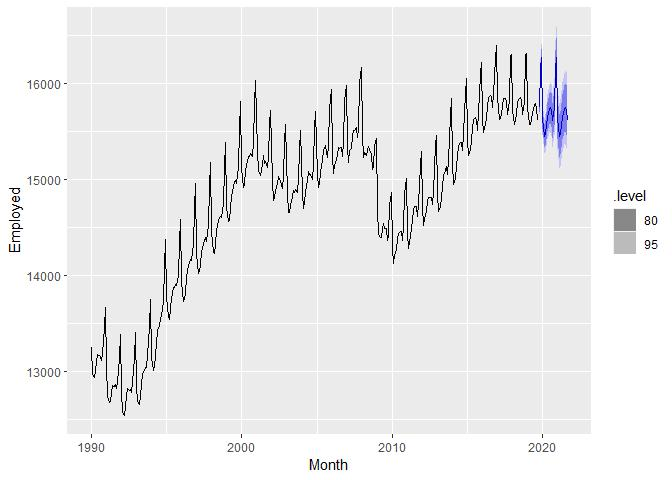

Las bases de los pronósticos
================

  - [Un flujo de trabajo limpio de
    pronóstico](#un-flujo-de-trabajo-limpio-de-pronóstico)
      - [1. Preparación de los datos
        (limpieza)](#preparación-de-los-datos-limpieza)
      - [2. Gráfica de los datos
        (visualización)](#gráfica-de-los-datos-visualización)
      - [3. Definición del modelo
        (especificación)](#definición-del-modelo-especificación)
      - [4. Entrenamiento del modelo
        (estimación)](#entrenamiento-del-modelo-estimación)
      - [5. Revisar el desempeño del modelo
        (evaluación)](#revisar-el-desempeño-del-modelo-evaluación)
      - [6. Producir pronósticos](#producir-pronósticos)
  - [Métodos sencillos de pronóstico](#métodos-sencillos-de-pronóstico)
      - [Método del promedio (media)](#método-del-promedio-media)
      - [Método ingenuo (Naïve method)](#método-ingenuo-naïve-method)
      - [Método ingenuo estacional (seasonal
        Naïve)](#método-ingenuo-estacional-seasonal-naïve)
      - [Método del drift (deriva)](#método-del-drift-deriva)
  - [Valores ajustados *(fitted)* y
    residuales](#valores-ajustados-fitted-y-residuales)
  - [Diagnóstico de residuales](#diagnóstico-de-residuales)
      - [Tests de Portmanteau de
        autocorrelación](#tests-de-portmanteau-de-autocorrelación)
  - [Intervalos de predicción](#intervalos-de-predicción)
      - [Intervalos de predicción de un
        paso](#intervalos-de-predicción-de-un-paso)
      - [Intervalos de predicción de paso múltiple
        (*multi-step*)](#intervalos-de-predicción-de-paso-múltiple-multi-step)
      - [Métodos de referencia](#métodos-de-referencia)
      - [Intervalos de predicción con residuales
        bootstrap](#intervalos-de-predicción-con-residuales-bootstrap)
  - [Tarea](#tarea)
  - [Pronósticos con
    transformaciones](#pronósticos-con-transformaciones)
      - [Intervalos de predicción con
        transformaciones](#intervalos-de-predicción-con-transformaciones)
      - [Ajustes por sesgo](#ajustes-por-sesgo)
  - [Pronósticos con descomposición](#pronósticos-con-descomposición)
  - [Evaluación del desempeño de los
    pronósticos](#evaluación-del-desempeño-de-los-pronósticos)
      - [Conjuntos de entrenamiento y
        prueba](#conjuntos-de-entrenamiento-y-prueba)
      - [Funciones para segmentar las series de
        tiempo](#funciones-para-segmentar-las-series-de-tiempo)
      - [Errores de pronóstico](#errores-de-pronóstico)
          - [Errores dependientes de la escala de los
            datos](#errores-dependientes-de-la-escala-de-los-datos)
          - [Errores porcentuales](#errores-porcentuales)

Las paqueterías a usar en este documento:

``` r
library("easypackages")
packages("tidyverse","fpp3")
```

    ## Loading required package: tidyverse

    ## -- Attaching packages -------------------------------- tidyverse 1.3.0 --

    ## v ggplot2 3.3.0     v purrr   0.3.4
    ## v tibble  3.0.1     v dplyr   0.8.5
    ## v tidyr   1.0.2     v stringr 1.4.0
    ## v readr   1.3.1     v forcats 0.5.0

    ## -- Conflicts ----------------------------------- tidyverse_conflicts() --
    ## x dplyr::filter() masks stats::filter()
    ## x dplyr::lag()    masks stats::lag()

    ## Loading required package: fpp3

    ## -- Attaching packages --------------------------------------- fpp3 0.2 --

    ## v lubridate   1.7.8     v feasts      0.1.3
    ## v tsibble     0.8.6     v fable       0.2.0
    ## v tsibbledata 0.1.0

    ## -- Conflicts ------------------------------------------ fpp3_conflicts --
    ## x lubridate::date()   masks base::date()
    ## x dplyr::filter()     masks stats::filter()
    ## x tsibble::id()       masks dplyr::id()
    ## x tsibble::interval() masks lubridate::interval()
    ## x dplyr::lag()        masks stats::lag()

    ## All packages loaded successfully

# Un flujo de trabajo limpio de pronóstico

El flujo de trabajo, cuando se va a realizar un proceso, se puede
dividir en pasos.

1.  Preparación de los datos (limpieza)
2.  Gráfica de los datos (visualización)
3.  Definición del modelo (especificación)
4.  Entrenamiento del modelo (estimación)
5.  Revisar el desempeño del modelo (evaluación)
6.  Producir pronósticos

### 1\. Preparación de los datos (limpieza)

Esto siempre es lo primero que se hace y puede ir desde simplemente
cargar los datos en **R**, hasta limpiezas más detalladas, como
identificar valores omitidos, `NA`, filtrado de la serie, etc. Para
esto, utilizamos varias funciones de las paqueterías `tsibble` y
`tidyverse`, que simplifican mucho estas tareas.

### 2\. Gráfica de los datos (visualización)

Continuaremos trabajando con los datos de `global_economy` para
ejemplificar esto.

``` r
global_economy %>%
  filter(Country == "Sweden") %>%
  autoplot(GDP) +
    ggtitle("PIB de Suecia") + ylab("$US billions")
```

<!-- -->

### 3\. Definición del modelo (especificación)

Antes de ajustar un modelo a los datos, se debe **describir** el modelo.
Existen muchos tipos de modelos de pronóstico distintos, y es muy
importante que escojamos el más apropiado, para obtener buenos
pronósticos.

Los modelos en **R**, como vimos con la regresión lineal (`lm(y ~ x1 +
x2 + ... + xn)`), se especifican en formato de fórmula ( `y ~ x`),
siendo la `y` la variable dependiente (o variable a explicar), y la o
las `x` las variables independientes (o variables explicativas,
regresoras, etc.).

Podemos tomar, p. ej., un modelo lineal de series de tiempo, `TSLM`,
modela los datos que se le incluyan mediante una tendencia lineal.

``` r
TSLM(GDP  ~ trend())
```

### 4\. Entrenamiento del modelo (estimación)

Una vez que se especificó el modelo, lo que sigue es entrenar al modelo.

Entrenar un modelo significa pasarle los datos para que,
estadísticamente, encuentre los parámetros que realizan el mejor ajuste
posible.

Siguiendo con el ejemplo del modelo lineal:

``` r
fit <- global_economy %>%
  model(trend_model = TSLM(GDP ~ trend()))
```

Con esto se ajustó un modelo lineal y el objeto resultante es un `mable`
(model table).

``` r
fit
```

    ## # A mable: 263 x 2
    ## # Key:     Country [263]
    ##    Country             trend_model
    ##    <fct>               <model>    
    ##  1 Afghanistan         <TSLM>     
    ##  2 Albania             <TSLM>     
    ##  3 Algeria             <TSLM>     
    ##  4 American Samoa      <TSLM>     
    ##  5 Andorra             <TSLM>     
    ##  6 Angola              <TSLM>     
    ##  7 Antigua and Barbuda <TSLM>     
    ##  8 Arab World          <TSLM>     
    ##  9 Argentina           <TSLM>     
    ## 10 Armenia             <TSLM>     
    ## # ... with 253 more rows

### 5\. Revisar el desempeño del modelo (evaluación)

Ya teniendo el modelo entrenado, debemos revisar el *performance* en los
datos reales. Esto es, ¿qué tan bien se ajusta el modelo a los datos?,
en caso de estar indecisos entre varios modelos, ¿cuál escogemos como el
mejor y por qué?

### 6\. Producir pronósticos

Cuando ya evaluamos que el modelo ajustado se encuentra dentro de los
parámetros deseados, podemos proceder a realizar los pronósticos. En
.**R**, podemos usar el comando `forecast()`, en el cual debemos
especificar el número de periodos a pronosticar. Por ejemplo, par
pronosticar los siguientes 12 meses, escribiríamos `h = 12`. También
podemos usar lenguaje ordinario (en inglés), `h = "1 year"`.

``` r
fit %>% forecast(h = "3 years")
```

    ## # A fable: 789 x 5 [1Y]
    ## # Key:     Country, .model [263]
    ##    Country        .model       Year           GDP .distribution      
    ##    <fct>          <chr>       <dbl>         <dbl> <dist>             
    ##  1 Afghanistan    trend_model  2018  16205101654. N(1.6e+10, 1.3e+19)
    ##  2 Afghanistan    trend_model  2019  16511878141. N(1.7e+10, 1.3e+19)
    ##  3 Afghanistan    trend_model  2020  16818654627. N(1.7e+10, 1.3e+19)
    ##  4 Albania        trend_model  2018  13733734164. N(1.4e+10, 3.9e+18)
    ##  5 Albania        trend_model  2019  14166852711. N(1.4e+10, 3.9e+18)
    ##  6 Albania        trend_model  2020  14599971258. N(1.5e+10, 3.9e+18)
    ##  7 Algeria        trend_model  2018 157895153441. N(1.6e+11, 9.4e+20)
    ##  8 Algeria        trend_model  2019 161100952126. N(1.6e+11, 9.4e+20)
    ##  9 Algeria        trend_model  2020 164306750811. N(1.6e+11, 9.4e+20)
    ## 10 American Samoa trend_model  2018    682475000  N(6.8e+08, 1.7e+15)
    ## # ... with 779 more rows

El resultado es una `fable` (forecasting table) o tabla de pronósticos.
El pronóstico se puede graficar fácilmente junto con los datos reales,
usando `autoplot()`.

``` r
fit %>% forecast(h = "3 years") %>%
  filter(Country=="Sweden") %>%
  autoplot(global_economy) +
    ggtitle("PIB de Suecia") + ylab("$US billions")
```

<!-- -->

# Métodos sencillos de pronóstico

Utilizaremos de *benchmark* a lo largo del curso estos métodos básicos
de pronóstico. En ocasiones, a pesar de su sencillez, pueden llegar a
ser muy útiles.

Utilizaremos los datos de producción de ladrillos para esta sección.

``` r
bricks <- aus_production %>% filter_index(1970 ~ 2004)
```

### Método del promedio (media)

En este pronóstico, las predicciones de todos los valores futuros son la
media de los datos históricos.

\[
\hat{y}_{T+h | T}=\bar{y}=\left(y_{1}+\cdots+y_{T}\right) / T
\]

``` r
bricks %>% model(MEAN(Bricks))
```

    ## # A mable: 1 x 1
    ##   `MEAN(Bricks)`
    ##   <model>       
    ## 1 <MEAN>

### Método ingenuo (Naïve method)

Aquí, lo que se hace es que se toma el último valor como el pronóstico
para todos los valores futuros.

\[
\hat{y}_{T+h | T}=y_{T}
\] Dado que un pronóstico ingenuo es óptimo cuando se tienen datos que
siguen una *caminata aleatoria*, a estos pronósticos se les conoce como
**pronósticos de caminata aleatoria**.

``` r
bricks %>% model(NAIVE(Bricks))
```

    ## # A mable: 1 x 1
    ##   `NAIVE(Bricks)`
    ##   <model>        
    ## 1 <NAIVE>

### Método ingenuo estacional (seasonal Naïve)

Un método similar es el ingenuo estacional. Lo que cambia con el
anterior es que se agrega un componente para lidiar con datos altamente
estacionales.

\[
\hat{y}_{T+h | T}=y_{T+h-m(k+1)}
\]

``` r
# Set training data from 1992 to 2006
train <- aus_production %>% filter_index("1992 Q1" ~ "2006 Q4")
# Fit the models
beer_fit <- train %>%
  model(
    Mean = MEAN(Beer),
    `Naïve` = NAIVE(Beer),
    `Seasonal naïve` = SNAIVE(Beer)
  )
# Generate forecasts for 14 quarters
beer_fc <- beer_fit %>% forecast(h=14)

# Plot forecasts against actual values
beer_fc %>%
  autoplot(train, level = NULL) +
    autolayer(filter_index(aus_production, "2007 Q1" ~ .), color = "black") +
    ggtitle("Forecasts for quarterly beer production") +
    xlab("Year") + ylab("Megalitres") +
    guides(colour=guide_legend(title="Forecast"))
```

    ## Plot variable not specified, automatically selected `.vars = Beer`

<!-- -->

### Método del drift (deriva)

Este método es una variación del método ingenuo, que permite que el
pronóstico aumente o disminuya en el tiempo. El aumento del cambio es
el cambio promedio en los datos históricos.

\[
\hat{y}_{T+h | T}=y_{T}+\frac{h}{T-1} \sum_{t=2}^{T}\left(y_{t}-y_{t-1}\right)=y_{T}+h\left(\frac{y_{T}-y_{1}}{T-1}\right)
\] Esto es lo mismo que trazar una línea recta que conecte el primer y
último punto en los datos históricos y continuar la recta hacia
adelante.

Otro ejemplo:

``` r
# Re-index based on trading days
google_stock <- gafa_stock %>%
  filter(Symbol == "GOOG") %>%
  mutate(day = row_number()) %>%
  update_tsibble(index = day, regular = TRUE)
# Filter the year of interest
google_2015 <- google_stock %>% filter(year(Date) == 2015)
# Fit the models
google_fit <- google_2015 %>%
  model(
    Mean = MEAN(Close),
    `Naïve` = NAIVE(Close),
    Drift = NAIVE(Close ~ drift())
  )
# Produce forecasts for the 19 trading days in January 2015
google_fc <- google_fit %>% forecast(h = 19)
# A better way using a tsibble to determine the forecast horizons
google_jan_2016 <- google_stock %>%
  filter(yearmonth(Date) == yearmonth("2016 Jan"))
google_fc <- google_fit %>% forecast(google_jan_2016)
# Plot the forecasts
google_fc %>%
  autoplot(google_2015, level = NULL) +
    autolayer(google_jan_2016, Close, color='black') +
    ggtitle("Google stock (daily ending 31 Dec 2015)") +
    xlab("Day") + ylab("Closing Price (US$)") +
    guides(colour=guide_legend(title="Forecast"))
```

<!-- -->

# Valores ajustados *(fitted)* y residuales

Cada observación en una serie de tiempo puede ser pronosticada
utilizando los datos históricos previos. A estos se les conoce como
valores ajustados (o *fitted*), \(\hat{y}_t\).

Los residuales en un modelo de series de tiempo es la información que el
modelo no logró capturar. Esto es, es la diferencia entre los valores
reales y los valores ajustados.

\[
e_{t}=y_{t}-\hat{y}_{t}
\]

En **R**, podemos obtener los valores ajustados y los residuales con la
función `augment()`. Recordando, habíamos ajustado tres modelos
distintos, que guardamos en la variable `beer_fit`.

``` r
augment(beer_fit)
```

    ## # A tsibble: 180 x 5 [1Q]
    ## # Key:       .model [3]
    ##    .model Quarter  Beer .fitted .resid
    ##    <chr>    <qtr> <dbl>   <dbl>  <dbl>
    ##  1 Mean   1992 Q1   443    436.   6.55
    ##  2 Mean   1992 Q2   410    436. -26.4 
    ##  3 Mean   1992 Q3   420    436. -16.4 
    ##  4 Mean   1992 Q4   532    436.  95.6 
    ##  5 Mean   1993 Q1   433    436.  -3.45
    ##  6 Mean   1993 Q2   421    436. -15.4 
    ##  7 Mean   1993 Q3   410    436. -26.4 
    ##  8 Mean   1993 Q4   512    436.  75.6 
    ##  9 Mean   1994 Q1   449    436.  12.6 
    ## 10 Mean   1994 Q2   381    436. -55.4 
    ## # ... with 170 more rows

Es muy importante analizar los residuos para determinar si nuestros
modelos están bien ajustados. Si logramos detectar patrones en los
residuales, puede ser indicio de que el modelo puede mejorarse.

# Diagnóstico de residuales

Un buen modelo de pronóstico va a producir residuales con las siguientes
características:

1.  **No están autocorrelacionados**. Si se detectan correlaciones entre
    residuos, todavía hay información útil que se debe modelar.

2.  **La media de los residuos es cero**. Si la media es distinta de
    cero, entonces el pronóstico está sesgado.

**Nota:** El hecho de que un pronóstico cumpla esto, no quiere decir que
sea el mejor pronóstico que podamos hacer. Próximamente revisaremos qué
otras medidas podemos evaluar para determinar cuál es el mejor
pronóstico.

Existen dos características adicionales que son útiles, mas no
necesarias, para los residuos de un pronóstico:

3.  Los residuos tienen una varianza constante.

4.  Los residuos se distribuyen de manera normal.

Las transformaciones de Box-Cox pueden ayudar, en algunos casos a lograr
cumplir estas características.

Continuemos con el ejemplo del pronóstico del precio de la acción de
Google. En muchas ocasiones, el mejor pronóstico para los precios de
mercados bursátiles e índices suele ser el realiado mediante el método
Naïve.

``` r
google_2015 %>% autoplot(Close) +
  xlab("Day") + ylab("Closing Price (US$)") +
  ggtitle("Google Stock in 2015")
```

<!-- -->

Aplicaremos solo el método Naïve para pronosticar el precio futuro de la
acción de Google.

``` r
aug <- google_2015 %>% model(NAIVE(Close)) %>% augment()
aug %>% autoplot(.resid) + xlab("Día") + ylab("") +
  ggtitle("Residuales del método naïve")
```

    ## Warning: Removed 1 row(s) containing missing values (geom_path).

<!-- -->

De la gráfica de los residuales podemos observar que la media parece
estar muy cercana al cero y que la variación parece invariante en el
tiempo, a excepción de un outlier.

``` r
aug %>%
  ggplot(aes(x = .resid)) +
  geom_histogram() +
  ggtitle("Histograma de los residuales")
```

    ## `stat_bin()` using `bins = 30`. Pick better value with `binwidth`.

<!-- -->
Del histograma, podemos ver que los residuales parecen distribuirse como
una normal, pero con una cola más grande.

``` r
aug %>% ACF(.resid) %>% autoplot() + ggtitle("ACF of residuals")
```

<!-- -->

La función de autocorrelación muestra que los residuos no están
autocorrelacionados.

Así, el método naïve parece generar pronósticos que capturan toda la
información relevante de la serie y, por lo tanto, que satisfacen todas
las características necesarias. Por consecuencia, los pronósticos
derivados de este método pueden ser bastante buenos, pero los intervalos
de predicción pudieran ser imprecisos.

Podemos obtener estas mismas gráficas con un solo comando,
`gg_tsresiduals()`.

``` r
google_2015 %>% model(NAIVE(Close)) %>% gg_tsresiduals()+ ggtitle("Diagnóstico de residuales para el modelo Naïve")
```

<!-- -->
Como vimos antes, el método Naïve es óptimo para este tipo de series.
¿Qué hubiera sucedido si ajustáramos otro modelo? Probemos con el
método de la media:

``` r
google_2015 %>% model(MEAN(Close)) %>% gg_tsresiduals() + ggtitle("Diagnóstico de residuales para el modelo de Media")
```

<!-- -->

Observamos que estas gráficas tienen un comportamiento muy distinto al
Naïve:

  - En la gráfica de los residuales vemos que se distingue claramente un
    patrón. De hecho, es el mismo patrón exactamente que siguen los
    datos originales, restándoles su media.

  - La función de autocorrelación tiene un comportamiento típico de una
    caminata aleatoria. Por lo tanto, las autocorrelaciones son
    significativas.

  - El histograma de los residuos muestra claramente que no se
    distribuyen de manera normal.

### Tests de Portmanteau de autocorrelación

Para analizar de manera más formal la presencia o ausencia de
autocorrelación en los residuos, podemos realizar estas pruebas
estadísticas para determinar si las primeras \(h\) autocorrelaciones
son significativamente distintas de cero o no.

#### Test de Box-Pierce

\[
Q=T \sum_{k=1}^{h} r_{k}^{2}
\] En este test, \(h\) es el rezago máximo a considerar y \(T\) es la
cantidad de observaciones en la muestra.

Si cada \(r_{k}^{2}\) es pequeña, entonces \(Q\) será pequeña. Se
sugiere utilizar \(h = 10\) para datos no estacionales y \(h = 2m\) para
datos estacionales (donde \(m\) es el periodo estacional). Sin embargo,
la prueba no es tan buena cuando \(h\) es grande, relativamente (o sea,
cuando \(h\) es mayor a \(T/5\)). En esos casos, es mejor utilizar
\(h = T/5\).

#### Test de Ljung-Box

Un test relacionado y que, generalmente, es más preciso es el test de
Ljung-Box.

\[
Q^{*}=T(T+2) \sum_{k=1}^{h}(T-k)^{-1} r_{k}^{2}
\] En este caso es igual: valores grandes de \(Q^{*}\) son indicios de
que las autocorrelaciones no provienen de ruido blanco.

``` r
# lag=h and fitdf=K
aug %>% features(.resid, box_pierce, lag=10, dof=0)
```

    ## # A tibble: 1 x 4
    ##   Symbol .model       bp_stat bp_pvalue
    ##   <chr>  <chr>          <dbl>     <dbl>
    ## 1 GOOG   NAIVE(Close)    7.74     0.654

``` r
aug %>% features(.resid, ljung_box, lag=10, dof=0)
```

    ## # A tibble: 1 x 4
    ##   Symbol .model       lb_stat lb_pvalue
    ##   <chr>  <chr>          <dbl>     <dbl>
    ## 1 GOOG   NAIVE(Close)    7.91     0.637

En ambas pruebas, el p-value resulta ser muy alto, por lo que no podemos
distinguir los residuales del ruido blanco.

# Intervalos de predicción

Un intervalo de predicción se puede escribir como

\[\hat{y}_{T+h | T} \pm c \hat{\sigma}_{h}\] donde \(c\) es el
porcentaje de cobertura de probabilidad. Normalmente utilizaremos 80% y
95%, pero se puede utilizar cualquier porcentaje.

La utilidad de los intervalos de predicción yace en el hecho de que
nuestros pronósticos tienen cierta incertidumbre. Así, entre mayor sea
el intervalo, menos preciso será nuestro pronóstico, y vice versa.

Un pronóstico puntual por si solo no sirve de gran cosa. Es necesario
acompañarlo de su intervalo de predicción.

### Intervalos de predicción de un paso

Cuando se realizan pronósticos de un paso (*one-step forecast*), la
desviación estándar del pronóstico es prácticamente la misma que la
desviación estándar de los residuos.

### Intervalos de predicción de paso múltiple (*multi-step*)

Conforme se va aumentando el horizonte de pronostico, el intervalo de
predicción tiende a aumentar. Entre más adelante en el tiempo queramos
pronosticar, tendremos mayor incertidumbre (no es lo mismo querer
predecir el tipo de cambio para mañana, que el de diciembre, p. ej.).
Esto es, \(\sigma_h\) incrementa con \(h\). Entonces, requerimos
estimaciones de \(\sigma_h\).

Para el caso del one-step forecast, ya vimos que podemos tomar la
desviación estándar de los residuos como estimación de \(\sigma_h\).
Para el caso multi-step, asumimos que los residuos no están
autocorrelacionados y se requieren métodos de cálculo un poco más
complejos.

### Métodos de referencia

Si \(\hat{\sigma}\) es la desviación estándar de los residuos y
\(\hat{\sigma}_{h}\) es la desviación estándar del pronóstico
\(h\)-step, podemos calcular para cada método de pronóstico de
referencia:

**Pronósticos de media:**
\(\hat{\sigma}_{h}=\hat{\sigma} \sqrt{1+1 / T}\)

**Pronósticos naïve:** \(\hat{\sigma}_{h}=\hat{\sigma} \sqrt{h}\)

**Pronósticos naïve estacionales:**
\(\hat{\sigma}_{h}=\hat{\sigma} \sqrt{k+1}\), donde \(k\) es la parte
entera de \((h-1)/m\).

**Pronósticos de drift:**
\(\hat{\sigma}_{h}=\hat{\sigma} \sqrt{h(1+h / T)}\).

Utilizando la paquetería `fable`, es muy sencillo obtener pronósticos y
sus bandas.

``` r
google_2015 %>%
  model(NAIVE(Close)) %>%
  forecast(h = 10) %>%
  hilo()

#> # A tsibble: 10 x 6 [1]
#> # Key:       Symbol, .model [1]
#>    Symbol .model         day Close            `80%`            `95%`
#>    <chr>  <chr>        <dbl> <dbl>           <hilo>           <hilo>
#>  1 GOOG   NAIVE(Close)   505  759. [744.5, 773.2]80 [736.9, 780.8]95
#>  2 GOOG   NAIVE(Close)   506  759. [738.6, 779.2]80 [727.9, 789.9]95
#>  3 GOOG   NAIVE(Close)   507  759. [734.0, 783.7]80 [720.9, 796.9]95
#>  4 GOOG   NAIVE(Close)   508  759. [730.2, 787.6]80 [715.0, 802.7]95
#>  5 GOOG   NAIVE(Close)   509  759. [726.8, 790.9]80 [709.8, 807.9]95
#>  6 GOOG   NAIVE(Close)   510  759. [723.8, 794.0]80 [705.2, 812.6]95
#>  7 GOOG   NAIVE(Close)   511  759. [720.9, 796.8]80 [700.9, 816.9]95
#>  8 GOOG   NAIVE(Close)   512  759. [718.3, 799.4]80 [696.8, 820.9]95
#>  9 GOOG   NAIVE(Close)   513  759. [715.9, 801.9]80 [693.1, 824.7]95
#> 10 GOOG   NAIVE(Close)   514  759. [713.5, 804.2]80 [689.5, 828.2]95
```

Esto mismo se puede graficar, como lo hemos hecho anteriormente:

``` r
google_2015 %>%
  model(NAIVE(Close)) %>%
  forecast(h = 10) %>%
  autoplot(google_2015)
```

<!-- -->

### Intervalos de predicción con residuales bootstrap

Cuando no es razonable asumir **normalidad** en los residuos, podemos
aplicarles *bootstraping*, ya que esto solo asume la no autocorrelación.

Teníamos que los residuos se calculan \(e_{t}=y_{t}-\hat{y}_{t | t-1}\).
Reescribiendo, tenemos que:

\[y_{t}=\hat{y}_{t | t-1}+e_{t}\] y podemos simular la siguiente
observación de una serie de tiempo con:

\[y_{T+1}=\hat{y}_{T+1 | T}+e_{T+1}\]

donde \(\hat{y}_{T+1} | T\) es el pronóstico de un periodo (one-step) y
\(e_{T+1}\) es el error futuro (que desconocemos). Ya que no están
autocorelacionados los errores, y puesto que asumimos que los errores
futuros serán similares a los históricos, podemos cambiar \(e_{T+1}\) al
hacer un muestreo de los residuos. Podemos realizar el mismo proceso
para \(y_{T+2}, y_{T+3}, \dots\).

Si realizamos esto varias veces, obtendremos muchos escenarios futuros
posibles. Para ver algunos de ellos, utilizamos `generate`.


``` r
fit <- google_2015 %>%
  model(NAIVE(Close))
sim <- fit %>% generate(h = 30, times = 5, bootstrap = TRUE)
sim
```

    ## # A tsibble: 150 x 5 [1]
    ## # Key:       Symbol, .model, .rep [5]
    ##    Symbol .model        .rep   day  .sim
    ##    <chr>  <chr>        <int> <dbl> <dbl>
    ##  1 GOOG   NAIVE(Close)     1   505  758.
    ##  2 GOOG   NAIVE(Close)     1   506  758.
    ##  3 GOOG   NAIVE(Close)     1   507  763.
    ##  4 GOOG   NAIVE(Close)     1   508  755.
    ##  5 GOOG   NAIVE(Close)     1   509  758.
    ##  6 GOOG   NAIVE(Close)     1   510  768.
    ##  7 GOOG   NAIVE(Close)     1   511  759.
    ##  8 GOOG   NAIVE(Close)     1   512  749.
    ##  9 GOOG   NAIVE(Close)     1   513  735.
    ## 10 GOOG   NAIVE(Close)     1   514  746.
    ## # ... with 140 more rows

Lo que hicimos fue generar 5 escenarios futuros posibles (`times = 5`)
para los siguientes 30 días de trading (`h = 30`). Si graficamos esto,
tenemos:

``` r
google_2015 %>%
  ggplot(aes(x = day)) +
  geom_line(aes(y = Close)) +
  geom_line(aes(y = .sim, colour = as.factor(.rep)), data = sim) +
  ggtitle("Google closing stock price") +
  guides(col = FALSE)
```

<!-- -->

Con esto, podemos obtener intervalos de predicción, al calcular los
percentiles de los escenarios futuros. El resultado se llama **intervalo
de predicción bootstrapped**. Esto se puede lograr fácilmente con
`forecast`.

``` r
fc <- fit %>% forecast(h = 30, bootstrap = TRUE)
fc
```

    ## # A fable: 30 x 5 [1]
    ## # Key:     Symbol, .model [1]
    ##    Symbol .model         day Close .distribution  
    ##    <chr>  <chr>        <dbl> <dbl> <dist>         
    ##  1 GOOG   NAIVE(Close)   505  759. sim(=dbl[5000])
    ##  2 GOOG   NAIVE(Close)   506  759. sim(=dbl[5000])
    ##  3 GOOG   NAIVE(Close)   507  759. sim(=dbl[5000])
    ##  4 GOOG   NAIVE(Close)   508  759. sim(=dbl[5000])
    ##  5 GOOG   NAIVE(Close)   509  759. sim(=dbl[5000])
    ##  6 GOOG   NAIVE(Close)   510  759. sim(=dbl[5000])
    ##  7 GOOG   NAIVE(Close)   511  759. sim(=dbl[5000])
    ##  8 GOOG   NAIVE(Close)   512  759. sim(=dbl[5000])
    ##  9 GOOG   NAIVE(Close)   513  759. sim(=dbl[5000])
    ## 10 GOOG   NAIVE(Close)   514  759. sim(=dbl[5000])
    ## # ... with 20 more rows

Graficando:

``` r
fc %>% autoplot(google_2015) +
  ggtitle("Google closing stock price")
```

<!-- -->

# Tarea

1.  Conseguir datos históricos sobre dos series de tiempo.
2.  Seguir los pasos del flujo de trabajo de pronóstico.
3.  Estimar los modelos de referencia (*benchmark*) que consideren
    adecuados para su serie.
4.  Realicen el diagnóstico de residuales e interpreten los resultados.
5.  Ejecuten un pronóstico (ustedes deciden el horizonte de pronóstico)
    y definan si utilizar el método bootstrap o no y justifiquen su
    decisión.

# Pronósticos con transformaciones

¿Qué sucede cuando realizamos pronósticos de series a las que les
hicimos alguna transformación? Por ejemplo, si los contratan para
pronosticar las ventas de cubrebocas en la farmacia y ustedes hubieran
realizado una transformación logarítmica de los datos, ¿cómo se realiza
el pronóstico?

Cuando se realiza una transformación matemática, el pronóstico se hace
con esa serie transformada, y posteriormente tenemos que darle *reversa*
a la transformación (*back-transformation*), para obtener pronósticos en
la escala original de la serie.

La transformación inversa de Box-Cox está dada por:

\[
y_{t}=\left\{\begin{array}{ll}
\exp \left(w_{t}\right) & \text { si } \lambda=0 \\
\left(\lambda w_{t}+1\right)^{1 / \lambda} & \text { en otro caso }
\end{array}\right.
\]

La paquetería `fable` convenientemente realiza la transformación inversa
en automático, cuando se especifica en la definición del modelo.

### Intervalos de predicción con transformaciones

El intervalo de predicción de una serie transformada se calcula,
primeramente, en la escala transformada, y posteriormente se hace la
transformación inversa a la escala original. Hacer esto mantiene los
porcentajes de cobertura de probabilidad originales, pero el resultado
ya no es simétrico alrededor de la estimación puntual.

Es importante mencionar que las transformaciones tienen muy poco efecto
en la estimación puntual, pero pueden llegar a tener un gran impacto en
los intervalos de predicción.

### Ajustes por sesgo

Un problema al realizar transformaciones matemáticas, como Box-Cox es
que la estimaciones puntuales re transformadas ya no representan la
**media** de la distribución de predicción, sino que representan ahora
la **mediana**. En muchos casos puede no ser tan grave esto, pero en
ocasiones el pronóstico promedio es requerido:

  - *P. ej., si quieren realizar el pronóstico de la venta de cubrebocas
    en las farmacias de la ZMG, para, al sumarlos, obtener el pronóstico
    de las ventas totales de cubrebocas en ZMG. La suma de las medias da
    como resultado el total, pero la suma de medianas no.*

La transformación inversa de la media, para Box-Cox es:

\[
y_{t}=\left\{\begin{array}{ll}
\exp \left(w_{t}\right)\left[1+\frac{\sigma_{h}^{2}}{2}\right] & \text { si } \lambda=0 \\
\left(\lambda w_{t}+1\right)^{1 / \lambda}\left[1+\frac{\sigma_{h}^{2}(1-\lambda)}{2\left(\lambda w_{t}+1\right)^{2}}\right] & \text { en otro caso }
\end{array}\right.
\] donde \(\sigma_{h}^{2}\) es la varianza del pronóstico en el
horizonte-\(h\) en la escala transformada. Entre más grande sea la
varianza, mayor será la diferencia entre la media y la mediana. A esto
se le conoce como la estimación **ajustada por sesgo**.

Veamos un ejemplo sobre el pronóstico del precio promedio del huevo.

``` r
eggs <- as_tsibble(fma::eggs)
```

    ## Registered S3 method overwritten by 'quantmod':
    ##   method            from
    ##   as.zoo.data.frame zoo

``` r
fit <- eggs %>% model(RW(log(value) ~ drift()))
fc <- fit %>% forecast(h=50) %>%
  mutate(Forecast = "Bias adjusted")
fc_biased <- fit %>% forecast(h=50, bias_adjust = FALSE) %>%
  mutate(Forecast = "Simple back transformation")
eggs %>% autoplot(value) +
  autolayer(fc_biased, level = 80) +
  autolayer(fc, colour = "red", level = NULL)
```

<!-- -->

La línea azul representa el pronóstico sesgado, mientras que la línea
roja muestra el pronóstico corregido por el sesgo. `fable` en automático
nos produce pronósticos ajustados por sesgo. Como se ve en el código,
para generar pronósticos sesgados, tenemos que especificarlo mediante
`bias_adjust = FALSE`.

# Pronósticos con descomposición

La descomposición de series de tiempo puede ser útil para producir
pronósticos. Reescribiendo las fórmulas de descomposición aditiva y
multiplicativa:

\[y_{t}=\hat{S}_{t}+\hat{A}_{t}\]

donde \(\hat{A}_{t}\) es la serie desestacionalizada (
\(\hat{A}_{t} = \hat{T}_{t} + \hat{R}_{t}\)).

\[y_{t}=\hat{S}_{t}\hat{A}_{t}\]

con \(\hat{A}_{t} = \hat{T}_{t} \hat{R}_{t}\).

Así, el pronóstico se realiza en dos pasos: un pronóstico para el
componente estacional, y un pronóstico separado para la serie
desestacionalizada. De hecho, el pronóstico del componente estacional es
simplemente el método **naïve estacional**. Para los datos
desestacionalizados, podemos utilizar cualquier modelo de pronóstico que
veremos más adelante.

``` r
us_retail_employment <- us_employment %>%
  filter(year(Month) >= 1990, Title == "Retail Trade")
dcmp <- us_retail_employment %>%
  model(STL(Employed ~ trend(window = 7), robust=TRUE)) %>%
  components() %>%
  select(-.model)
dcmp %>%
  model(NAIVE(season_adjust)) %>%
  forecast() %>%
  autoplot(dcmp) + ylab("New orders index") +
  ggtitle("Pronóstico naïve de los datos desestacionalizados")
```

<!-- -->

A esta serie, podemos agregarle nuevamente la estacionalidad con la
función `decomposition_model()`.

``` r
us_retail_employment %>%
  model(stlf = decomposition_model(
             STL(Employed ~ trend(window = 7), robust = TRUE),
             NAIVE(season_adjust)
  )) %>%
  forecast() %>%
  autoplot(us_retail_employment)
```

<!-- -->

# Evaluación del desempeño de los pronósticos

### Conjuntos de entrenamiento y prueba

Como hemos dicho, es muy importante separar nuestros datos en dos
conjuntos: un conjunto de datos de **entrenamiento**, que son los que se
utilizan para estimar el modelo, y un conjunto de datos de **prueba**,
donde se evalúa el desempeño del pronóstico.

El tamaño de la prueba es, generalmente, del 20% del total de datos
disponibles, aunque también puede depender del horizonte de pronóstico
requerido. La prueba tiene que ser al menos tan grande como el horizonte
de pronóstico más largo que se requiera (si se necesitan pronósticos
para todo el siguiente año, la prueba tiene que ser del tamaño de al
menos de todo el siguiente año).

**NOTA**: Es importante tener en cuenta lo siguiente:

  - Un modelo que se ajusta muy bien a los datos de entrenamiento no
    necesariamente produce los mejores pronósticos.

  - Podemos llegar a tener un ajuste perfecto del modelo a los datos, si
    aumentamos la cantidad de parámetros.

  - Puede darse un efecto de sobre ajuste (mejor conocido como
    *over-fitting*) y esto es tan malo como tener un muy mal ajuste.

En alguna literatura o paqueterías pueden encontrar que al conjunto de
datos de entrenamiento se les conozca como “*in-sample data*” y al
conjunto de prueba “*out-of-sample data*”.

### Funciones para segmentar las series de tiempo

Hemos visto que podemos utilizar la función `filter` para filtrar una
base de datos o una serie de tiempo.

``` r
aus_production
```

    ## # A tsibble: 218 x 7 [1Q]
    ##    Quarter  Beer Tobacco Bricks Cement Electricity   Gas
    ##      <qtr> <dbl>   <dbl>  <dbl>  <dbl>       <dbl> <dbl>
    ##  1 1956 Q1   284    5225    189    465        3923     5
    ##  2 1956 Q2   213    5178    204    532        4436     6
    ##  3 1956 Q3   227    5297    208    561        4806     7
    ##  4 1956 Q4   308    5681    197    570        4418     6
    ##  5 1957 Q1   262    5577    187    529        4339     5
    ##  6 1957 Q2   228    5651    214    604        4811     7
    ##  7 1957 Q3   236    5317    227    603        5259     7
    ##  8 1957 Q4   320    6152    222    582        4735     6
    ##  9 1958 Q1   272    5758    199    554        4608     5
    ## 10 1958 Q2   233    5641    229    620        5196     7
    ## # ... with 208 more rows

Por ejemplo, tomando la producción en Australia, podemos filtrar para
tener los datos a partir de 1995:

``` r
aus_production %>% filter(year(Quarter) >= 1995)
```

    ## # A tsibble: 62 x 7 [1Q]
    ##    Quarter  Beer Tobacco Bricks Cement Electricity   Gas
    ##      <qtr> <dbl>   <dbl>  <dbl>  <dbl>       <dbl> <dbl>
    ##  1 1995 Q1   426    4714    430   1626       41768   131
    ##  2 1995 Q2   408    3939    457   1703       43686   167
    ##  3 1995 Q3   416    6137    417   1733       46022   181
    ##  4 1995 Q4   520    4739    370   1545       42800   145
    ##  5 1996 Q1   409    4275    310   1526       43661   133
    ##  6 1996 Q2   398    5239    358   1593       44707   162
    ##  7 1996 Q3   398    6293    379   1706       46326   184
    ##  8 1996 Q4   507    5575    369   1699       43346   146
    ##  9 1997 Q1   432    4802    330   1511       43938   135
    ## 10 1997 Q2   398    5523    390   1785       45828   171
    ## # ... with 52 more rows

o para obtener los datos de una cierta estación:

``` r
aus_production %>% filter(quarter(Quarter) == 1)
```

    ## # A tsibble: 55 x 7 [1Q]
    ##    Quarter  Beer Tobacco Bricks Cement Electricity   Gas
    ##      <qtr> <dbl>   <dbl>  <dbl>  <dbl>       <dbl> <dbl>
    ##  1 1956 Q1   284    5225    189    465        3923     5
    ##  2 1957 Q1   262    5577    187    529        4339     5
    ##  3 1958 Q1   272    5758    199    554        4608     5
    ##  4 1959 Q1   261    5478    208    573        4883     5
    ##  5 1960 Q1   286    5980    242    621        5387     6
    ##  6 1961 Q1   295    6022    241    688        5709     6
    ##  7 1962 Q1   279    6072    229    637        6098     6
    ##  8 1963 Q1   294    6051    231    674        6707     6
    ##  9 1964 Q1   313    5890    293    797        7469     6
    ## 10 1965 Q1   331    6201    309    902        8170     6
    ## # ... with 45 more rows

Otra función útil para filtrar o segmentar series de tiempo es
`slice()`, que utiliza el índice para filtrar los datos.

``` r
aus_production %>%
  slice(n()-19:0)
```

    ## # A tsibble: 20 x 7 [1Q]
    ##    Quarter  Beer Tobacco Bricks Cement Electricity   Gas
    ##      <qtr> <dbl>   <dbl>  <dbl>  <dbl>       <dbl> <dbl>
    ##  1 2005 Q3   408      NA     NA   2340       56043   221
    ##  2 2005 Q4   482      NA     NA   2265       54992   180
    ##  3 2006 Q1   438      NA     NA   2027       57112   171
    ##  4 2006 Q2   386      NA     NA   2278       57157   224
    ##  5 2006 Q3   405      NA     NA   2427       58400   233
    ##  6 2006 Q4   491      NA     NA   2451       56249   192
    ##  7 2007 Q1   427      NA     NA   2140       56244   187
    ##  8 2007 Q2   383      NA     NA   2362       55036   234
    ##  9 2007 Q3   394      NA     NA   2536       59806   245
    ## 10 2007 Q4   473      NA     NA   2562       56411   205
    ## 11 2008 Q1   420      NA     NA   2183       59118   194
    ## 12 2008 Q2   390      NA     NA   2558       56660   229
    ## 13 2008 Q3   410      NA     NA   2612       64067   249
    ## 14 2008 Q4   488      NA     NA   2373       59045   203
    ## 15 2009 Q1   415      NA     NA   1963       58368   196
    ## 16 2009 Q2   398      NA     NA   2160       57471   238
    ## 17 2009 Q3   419      NA     NA   2325       58394   252
    ## 18 2009 Q4   488      NA     NA   2273       57336   210
    ## 19 2010 Q1   414      NA     NA   1904       58309   205
    ## 20 2010 Q2   374      NA     NA   2401       58041   236

Esto filtra los últimos 20 datos (5 años).

Podemos usar `slice` para datos agrupados:

``` r
aus_retail %>%
  group_by(State, Industry) %>%
  slice(1:12)
```

    ## # A tsibble: 1,824 x 5 [1M]
    ## # Key:       State, Industry [152]
    ## # Groups:    State, Industry [152]
    ##    State               Industry                   `Series ID`     Month Turnover
    ##    <chr>               <chr>                      <chr>           <mth>    <dbl>
    ##  1 Australian Capital~ Cafes, restaurants and ca~ A3349849A   1982 abr.      4.4
    ##  2 Australian Capital~ Cafes, restaurants and ca~ A3349849A   1982 may.      3.4
    ##  3 Australian Capital~ Cafes, restaurants and ca~ A3349849A   1982 jun.      3.6
    ##  4 Australian Capital~ Cafes, restaurants and ca~ A3349849A   1982 jul.      4  
    ##  5 Australian Capital~ Cafes, restaurants and ca~ A3349849A   1982 ago.      3.6
    ##  6 Australian Capital~ Cafes, restaurants and ca~ A3349849A   1982 sep.      4.2
    ##  7 Australian Capital~ Cafes, restaurants and ca~ A3349849A   1982 oct.      4.8
    ##  8 Australian Capital~ Cafes, restaurants and ca~ A3349849A   1982 nov.      5.4
    ##  9 Australian Capital~ Cafes, restaurants and ca~ A3349849A   1982 dic.      6.9
    ## 10 Australian Capital~ Cafes, restaurants and ca~ A3349849A   1983 ene.      3.8
    ## # ... with 1,814 more rows

Otra función es `top_n`, la cual nos permite obtener las `n`
observaciones más extremas.

``` r
gafa_stock %>%
  group_by(Symbol) %>%
  top_n(1, Close)
```

    ## # A tsibble: 4 x 8 [!]
    ## # Key:       Symbol [4]
    ## # Groups:    Symbol [4]
    ##   Symbol Date        Open  High   Low Close Adj_Close   Volume
    ##   <chr>  <date>     <dbl> <dbl> <dbl> <dbl>     <dbl>    <dbl>
    ## 1 AAPL   2018-10-03  230.  233.  230.  232.      230. 28654800
    ## 2 AMZN   2018-09-04 2026. 2050. 2013  2040.     2040.  5721100
    ## 3 FB     2018-07-25  216.  219.  214.  218.      218. 58954200
    ## 4 GOOG   2018-07-26 1251  1270. 1249. 1268.     1268.  2405600

## Errores de pronóstico

El error de pronóstico es la diferencia entre el valor real ocurrido y
el dato pronosticado.

\[e_{T+h}=y_{T+h}-\hat{y}_{T+h | T}\]

Los errores de pronóstico son distintos de los residuales en dos formas:

1.  Los residuales se calculan con los datos de *entrenamiento*,
    mientras que los errores de pronóstico se calculan con los de
    *prueba*.
2.  Los residuos se calculan mediante pronósticos de un paso (one-step),
    donde los errores de pronóstico pueden ser multi-step.

Hay muchos tipos de cálculo del error general de un modelo de
pronóstico.

### Errores dependientes de la escala de los datos

Los errores de pronóstico están medidos en la misma escala de los datos
originales. Hay ciertos tipos de error que solo se basan en \(e_{T}\),
por lo que también dependen de la escala y no pueden ser utilizados para
comparar el desempeño con otra serie de tiempo que tenga otras unidades.

Los dos más utilizados en este rubro son el **MAE** y el **RMSE**.

\[
\begin{aligned}
&\text { Mean absolute error: } \mathrm{MAE}=\operatorname{mean}\left(\left|e_{t}\right|\right)\\
&\text { Root mean squared error: } \operatorname{RMSE}=\sqrt{\operatorname{mean}\left(e_{t}^{2}\right)}
\end{aligned}
\]

El MAE es muy utilizado debido a su facilidad de cómputo y de
interpretación. Un método de pronóstico que minimiza el MAE nos dará
pronósticos de la mediana de la distribución. Pronósticos que minimizan
el RMSE obtienen pronósticos de la media, por lo que este método también
es muy utilizado, a pesar de ser más pesado computacionalmente y
complicado de interpretar.

### Errores porcentuales

Los errores porcentuales, al ser un porcentaje, no tienen unidades y son
utilizados para comparar el desempeño de pronósticos de distintos
conjuntos de datos. El más utilizado es el MAPE (error absoluto promedio
porcentual). Si definimos al error porcentual como
\(p_{t}=100 e_{t} / y_{t}\)

Mean absolute percentage error: **MAPE**
\(=\operatorname{mean}\left(\left|p_{t}\right|\right)\)

La desventaja con estos errores es que se indeterminana o vuelven
infinitos con valores de \(y_t = 0\). Para ello, se definió el MAPE
simétrico:

\[\operatorname{sMAPE}=\operatorname{mean}\left(200\left|y_{t}-\hat{y}_{t}\right| /\left(y_{t}+\hat{y}_{t}\right)\right)\]

Aunque este método no se recomienda tanto utilizarlo en la práctica.

``` r
recent_production <- aus_production %>% filter(year(Quarter) >= 1992)
beer_train <- recent_production %>% filter(year(Quarter) <= 2007)

beer_fit <- beer_train %>%
  model(
    Mean = MEAN(Beer),
    `Naïve` = NAIVE(Beer),
    `Seasonal naïve` = SNAIVE(Beer),
    Drift = RW(Beer ~ drift())
  )

beer_fc <- beer_fit %>%
  forecast(h = 10)

beer_fc %>%
  autoplot(recent_production, level = NULL) +
  xlab("Year") + ylab("Megalitres") +
  ggtitle("Forecasts for quarterly beer production") +
  guides(colour=guide_legend(title="Forecast"))
```

<!-- -->

``` r
accuracy(beer_fc, recent_production)
```

    ## # A tibble: 4 x 9
    ##   .model         .type    ME  RMSE   MAE    MPE  MAPE  MASE    ACF1
    ##   <chr>          <chr> <dbl> <dbl> <dbl>  <dbl> <dbl> <dbl>   <dbl>
    ## 1 Drift          Test  -54.0  64.9  58.9 -13.6  14.6  4.12  -0.0741
    ## 2 Mean           Test  -13.8  38.4  34.8  -3.97  8.28 2.44  -0.0691
    ## 3 Naïve          Test  -51.4  62.7  57.4 -13.0  14.2  4.01  -0.0691
    ## 4 Seasonal naïve Test    5.2  14.3  13.4   1.15  3.17 0.937  0.132
