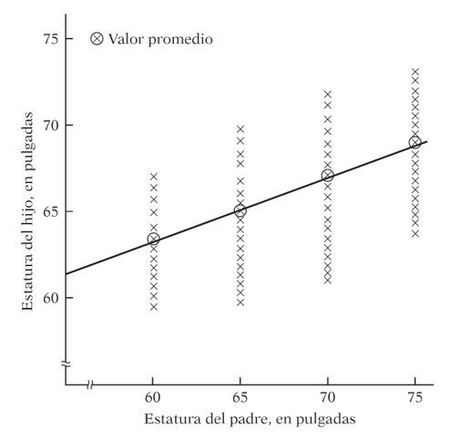
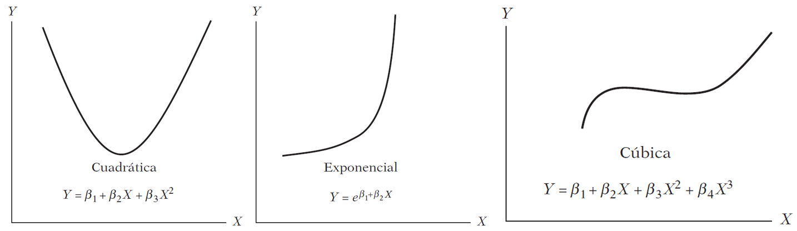

# Prerrequisitos

Se requieren cargar las siguientes paqueterías para seguir los ejemplos.

```{r, message=FALSE}
library(easypackages)
libraries("tidyverse","fpp3","plotly")
```


# Introducción

Los modelos que veremos aquí tienen como idea principal encontrar relaciones lineales entre la serie que queremos pronosticar, $y$, con una o más series distintas, *x*. En otras palabras, pronosticaremos los valores futuros de una serie, a partir de los cambios en otra serie que la afecte.

Es muy común querer predecir de esta forma. Por ejemplo, una tienda de helados podría encontrar una relación entre sus **ventas** ($y$) y la **temperatura** ($x_1$). O las **ventas** de *Nike*, a partir de cuánto **gastan en publicidad y mercadotecnia**.

En la literatura podemos encontrar muchos nombres para las variables $y$ ^ $x$. P. ej.

| $y$ (var. de pronóstico) | $x$ (vars. predictoras) |
|:------------------------:|:-----------------------:|
| Var. dependiente         |  Vars. independientes   |
| Explicada                |  Explicativas           |
| Regresada                |  Regresoras             |
| Respuesta                |  Estímulo               |
| Resultado                |  Covariante             |
| Controlada               |  De control             |


# El modelo lineal

El caso más sencillo sería un **modelo de regresión lineal simple**, de la forma:

$$
y_t = \beta_0 + \beta_1 x_t + \varepsilon_t
$$

donde 

* $\beta_0$ es conocido como el *intercepto* y representa el **valor predicho cuando $x = 0$.** 

* $\beta_1$ es la *pendiente* de la recta. Nos indica el **cambio promedio en $y$, ante un cambio en una unidad de $x$**.

* El término de error, $\varepsilon_t$ se asume aleatorio y decimos que captura los cambios debido a todas las otras variables que pudieran llegar a afectar a $y_t$, que no están explícitamente especificadas en el modelo.

La recta resultante está dada entonces por $\beta_0 + \beta_1 x_t$, y la diferencia que existe en los puntos reales y ésta es $\varepsilon_t$.


*](../images/linreg.png)

## Ejemplo: gasto de consumo en EEUU

Como primer ejemplo, veamos las tasas de crecimiento del gasto de consumo, $y$, y su relación con el ingreso personal disponible, $x$.

La gráfica de tiempo de ambas series:

```{r}
us_change %>%
  ggplot(aes(x = Quarter)) +
  geom_line(aes(y = Consumption, colour = "Consumo")) +
  geom_line(aes(y = Income, colour = "Ingreso")) +
  ylab("cambio %") + xlab("Año") +
  guides(colour=guide_legend(title="Series")) + 
  theme(legend.position = "top")
```

Un diagrama de dispersión entre ambas series, para ver una posible correlación.

```{r}
us_change %>%
  ggplot(aes(x=Income, y=Consumption)) +
    ylab("Consumo (cambio % trimestral)") +
    xlab("Ingreso (cambio % trimestral)") +
    geom_point() +
    geom_smooth(method="lm", se=FALSE)
```

La línea azul en el gráfico sigue la ecuación que describe la **regresión lineal** que tiene por variable dependiente al consumo y como independiente al ingreso.

## ¿Qué es una regresión lineal?

### 


El término de regresión fue acuñado por primera vez por Francis Galton en 1886. Él estaba estudiando la relación que existe entre la estatura de los hijos y la estatura de los padres.

Lo que encontró fue lo siguiente, en resumen:

* Los padres más altos, tendían a tener hijos más altos, mientras que los padres bajos tendían a tener hijos bajos.

* En promedio, los hijos de padres altos no logran ser más altos que ellos. Similarmente, los hijos de padres bajos, en promedio son más altos que sus papás.

* Así, Galton decía que había una tendencia a **regresar** a la estatura promedio.





Entonces, *el análisis de regresión en tiempos modernos trata sobre la relación de la dependencia entre una variable $y$, respecto de una o más variables exógenas (regresoras $x$) para predecir el valor promedio de la variable dependiente.*

## Regresión y causalidad

<style>
div.orchid { background-color: orchid; border-radius: 5px; padding: 20px; color: black}
</style>
<div class = "orchid">

>“Una relación estadística, por más fuerte y sugerente que sea, nunca podrá establecer una conexión causal: nuestras ideas de causalidad deben provenir de estadísticas externas y, en último término, de una u otra teoría” (Kendall & Stuart, 1961)

<p style="text-align:center;font-weight:bold"> 
Regresión $\neq$ Causalidad
</p>
<p style="text-align:center;font-weight:bold"> 
Correlación $\neq$ Causalidad
</p>

</div>

<br>
<br>

* Una relación estadística por sí misma no puede implicar causalidad.
  * Se debe acudir a consideraciones a priori o teóricas.

<br>

* La causalidad puede determinarse también por sentido común.

## ¿Qué significa que un modelo sea lineal?

Se puede hablar de linealidad en dos sentidos:

1. Linealidad en las variables; $x$.
  - La esperanza condicional de $y$ es una función lineal de $x_i$.
  
2. Linealidad en los parámetros; $\beta$.
  - La esperanza condicional de $y$ es lineal en los parámetros $\beta_i$.

Para un modelo de regresión lineal, solo nos interesa que sea **lineal en los parámetros**.



Así, un modelo de regresión lineal puede generar una recta, o una variedad de curvas, dependiendo la **forma funcional** que se elija.

## Mínimos cuadrados ordinarios (MCO-OLS)


$$
H_0: \beta_0 = 0 \\
H_1: \beta_0 \neq 0
$$
$$
H_0: \beta_1 = 0 \\
H_1: \beta_1 \neq 0
$$


$$
\hat{y}_t = \hat{\beta}_0 + \hat{\beta}_1x_t + \hat{\varepsilon}_t \\
\hat{y}_t = 0.54454 + 0.27183 x_t + \hat{\varepsilon}_t
$$

$$
y_{consumo} = \beta_0 + \beta_1 x_{income} + \beta_2 x_{production} + \beta_3 x_{savings} + \beta_4 x_{unemployment}
$$


# Ejemplos

## US % change

```{r}
us_change
```

```{r}
us_change %>% 
  as_tibble() %>% 
  select(-Quarter) %>% 
  GGally::ggpairs()
```

**Una correlación, por más fuerte que sea entre dos variables, no puede implicar por sí misma causalidad.**

```{r}
us_change %>% 
  pivot_longer(cols = -Quarter) %>% 
  ggplot(aes(x = Quarter, y = value, color = name)) +
  geom_line() +
  facet_wrap(~ name, scales = "free_y") +
  theme(legend.position = "none")
```

### Regresión lineal simple

Realizamos un primer modelo, donde utilizaremos de variable predictora al ingreso disponible, para pronosticar el consumo.

```{r}
fit1 <- us_change %>% 
  model(reg_lin_simple = TSLM(Consumption ~ Income)
        )
fit1 %>%  report()
```

$$ 
H_0: \beta_i = 0
$$

$$
H_0: \beta_1 = \beta_2 = \beta_3 = \ldots = 0
$$


```{r}
augment(fit1) %>% 
  ggplot(aes(x = Quarter)) +
  geom_line(aes(y = Consumption, color = "Datos")) +
  geom_line(aes(y = .fitted, color = "Fitted"))+
  xlab("Año") + ylab(NULL) +
  ggtitle("Cambios porcentuales en el gasto de Consumo en EEUU") +
  guides(color = guide_legend(title = NULL))
```

El modelo no parece capturar adecuadamente la variación de los datos reales.

```{r}
augment(fit1) %>% 
  ggplot(aes(x = Consumption, y = .fitted)) +
  geom_point() +
  ylab("Fitted (valores ajustados)") +
  xlab("Datos (reales históricos)") +
  ggtitle("Cambios porcentuales en el gasto de Consumo en EEUU") +
  geom_abline(intercept = 0, slope = 1)
```

```{r}
fit1 %>% 
  gg_tsresiduals()
```

```{r}
augment(fit1) %>% 
  features(.resid, ljung_box, lag= 10, dof = 2)
```
Es evidente que este modelo se puede mejorar. Probemos incluyendo las otras predictoras.

## Regresión lineal múltiple

```{r}
fit2 <- us_change %>% 
  model(
    reg_lin_multiple = TSLM(Consumption ~ Income + 
                              Production + 
                              Savings + Unemployment)
  )
report(fit2)
```


```{r}
augment(fit2) %>% 
  ggplot(aes(x = Quarter)) +
  geom_line(aes(y = Consumption, color = "Datos")) +
  geom_line(aes(y = .fitted, color = "Fitted"))+
  xlab("Año") + ylab(NULL) +
  ggtitle("Cambios porcentuales en el gasto de Consumo en EEUU") +
  guides(color = guide_legend(title = NULL))
```

Este modelo parece capturar más variación de los datos históricos.

```{r}
augment(fit2) %>% 
  ggplot(aes(x = Consumption, y = .fitted)) +
  geom_point() +
  ylab("Fitted (valores ajustados)") +
  xlab("Datos (reales históricos)") +
  ggtitle("Cambios porcentuales en el gasto de Consumo en EEUU") +
  geom_abline(intercept = 0, slope = 1)
```

```{r}
fit2 %>% 
  gg_tsresiduals()
```

```{r}
augment(fit2) %>% 
  features(.resid, ljung_box, lag= 10, dof = 2)
```


```{r}
df <- left_join(us_change, residuals(fit2), by = "Quarter")
df %>% 
  select(-c(Consumption, .model)) %>% 
  pivot_longer(cols = c(Income:Unemployment)) %>% 
  ggplot(aes( x = value, y = .resid, color = name)) + 
  geom_point() + ylab("Residuales") + xlab("Predictoras") +
  facet_wrap(~ name, scales = "free_x") +
  theme(legend.position = "none")
```

```{r}
augment(fit2) %>% 
  ggplot(aes(x = .fitted, y = .resid)) +
  geom_point() +
  labs(x = "Ajustados", y = "Residuales")
```

```{r}
glance(fit2) %>% 
  select(adj_r_squared, AIC, AICc, BIC)
```


## Selección de predictoras

1. Escoger subconjuntos de predictoras y probarlo.

```{r}
fit3 <- us_change %>% 
  model(r1 = TSLM(Consumption ~ Income),
        r2 = TSLM(Consumption ~ Income + Production),
        r3 = TSLM(Consumption ~ Income + Production + Savings + Unemployment),
        r4 = TSLM(Consumption ~ Income + Production + Savings),
        r5 = TSLM(Consumption ~ Income + Savings + Unemployment),
        r6 = TSLM(Consumption ~ Income + Production + Unemployment),
        r7 = TSLM(Consumption ~ Income + Savings)
        )
fit3 %>% 
  glance() %>% 
  select(.model, adj_r_squared, AIC, AICc, BIC)
```

```{r}
fit3 %>% 
  select(r3) %>% 
  report()
```

2. Backwards stepwise regression:
  - Empezamos con un modelo que contenga todas las predictoras.
  - Quitamos una a la vez.
  - Mantenemos el modelo si mejora la medida de desempeño predictivo ($\bar{R}^2$, AICc,...).
  - Seguirlo haciendo hasta no encontrar mejoras adicionales.

Selección del modelo a través de *backwards stepwise regression* con base en el $AICc$ sugiere conservar el modelo que incluye **todas las predictoras**.

```{r}
us_change %>% 
  model(i = TSLM(Consumption ~ Income + Production + Savings + Unemployment),
        ii = TSLM(Consumption ~ Income + Production + Savings),
        iii = TSLM(Consumption ~ Income + Production + Unemployment),
        iv = TSLM(Consumption ~ Income + Savings + Unemployment),
        v = TSLM(Consumption ~ Production + Savings + Unemployment)
        ) %>% 
  glance() %>% 
  select(.model, adj_r_squared, AIC, AICc, BIC)
```

Con base en $BIC$ parece que el mejor modelo es el que incluye todas las predictoras **menos el desempleo**.

```{r}
us_change %>% 
  model(i = TSLM(Consumption ~ Income + Production + Savings + Unemployment),
        ii = TSLM(Consumption ~ Income + Production + Savings),
        iii = TSLM(Consumption ~ Income + Production),
        iv = TSLM(Consumption ~ Income + Savings),
        v = TSLM(Consumption ~ Production + Savings),
        vi = TSLM(Consumption ~ Income + Savings + Unemployment),
        vii = TSLM(Consumption ~ Production + Savings + Unemployment),
        viii = TSLM(Consumption ~ Income + Production + Unemployment)
        ) %>% 
  glance() %>% 
  select(.model, adj_r_squared, AIC, AICc, BIC)
```


3. Forwards stepwise regression:
  - Comenzar con un modelo que solo incluya al intercepto.
  - Se van agregando las predictoras una a la vez.
  - La predictora que mejore más al modelo se mantiene.
  - Se itera hasta no tener mejoría adicional.

## Pronóstico

### Pronósticos *ex-ante*

En estos pronósticos solo se utiliza información disponible hasta el último dato del histórico. A estos pronósticos se les considera como **pronósticos reales**. Aquí las predictoras se deben pronosticar antes de poder producir el pronóstico de la variable de interés.

### Pronósticos *ex-post*

Con estos pronósticos se utiliza información real disponible de las predictoras. Estos pronósticos ya no son **reales** (en el sentido estricto). La variable a pronosticar ($y$) sigue siendo desconocida.

### Pronósticos basados en escenarios

```{r}
fit_escenarios <- us_change %>% 
  model(lineal = TSLM(Consumption ~ Income + Savings + Unemployment))
# Necesitamos agregar nuevos datos de las predictoras
optimista_futuro <- new_data(us_change,4) %>% 
  mutate(Income = 0.5, 
         Savings = 0.5, 
         Unemployment = 0)

pesimista_futuro <- new_data(us_change,4) %>% 
  mutate(Income = -1, 
         Savings = -0.5, 
         Unemployment = 0)

fc_optimista <- forecast(fit_escenarios, new_data = optimista_futuro) %>% 
  mutate(Escenario = "Optimista") %>% 
  as_fable(response = "Consumo", key = c("Escenario",".model"))

fc_pesimista <- forecast(fit_escenarios, new_data = pesimista_futuro) %>% 
  mutate(Escenario = "Pesimista") %>% 
  as_fable(response = "Consumo", key = c("Escenario",".model"))

bind_rows(fc_optimista,fc_pesimista)

us_change %>% 
  autoplot(Consumption) +
  autolayer(bind_rows(fc_optimista,fc_pesimista))
```

Vamos a generar un pronóstico *ex-ante* del consumo. Para esto, necesitamos primero producir pronósticos de las predictoras:

```{r}
# mod_predictoras <- function(predictora, horizonte = 4) {
#   us_change %>% 
#     model(predictora = ARIMA(as.formula(predictora)) %>% 
#     forecast(h = horizonte)
# }
# 
# mod_predictoras(predictora = Income)

ingreso <-  us_change %>% 
  model(ETS = ETS(Income),
        ARIMA = ARIMA(Income)
        ) %>% 
  forecast(h = 4) 

ingreso %>% 
  autoplot(us_change, level = NULL)

produccion <- us_change %>% 
  model(
    ETS = ETS(Production),
    ARIMA = ARIMA(Production)
  ) %>% 
  forecast(h = 4)
produccion %>% 
  autoplot(us_change, level = NULL)

ahorro <- us_change %>% 
  model(
    ETS = ETS(Savings),
    ARIMA = ARIMA(Savings)
  ) %>% 
  forecast(h = 4)
ahorro %>% 
  autoplot(us_change, level = NULL)

desempleo <- us_change %>% 
  model(
    ETS = ETS(Unemployment),
    ARIMA = ARIMA(Unemployment)
  ) %>% 
  forecast(h = 4)
desempleo %>% 
  autoplot(us_change, level = NULL)
```

Teniendo ya los pronósticos de cada predictora, podemos proceder a generar el pronóstico del consumo.

```{r}
fit <- us_change %>% 
  model(
    `Regresión lineal múltiple` = TSLM(Consumption ~ Income + Production + Savings + Unemployment)
  )

datos_futuros <- new_data(us_change,4) %>% 
  mutate(Income = ingreso %>% filter(.model == "ARIMA") %>% pull(.mean), 
         Savings = ahorro %>% filter(.model == "ARIMA") %>% pull(.mean), 
         Unemployment = desempleo %>% filter(.model == "ARIMA") %>% pull(.mean),
         Production = produccion %>% filter(.model == "ARIMA") %>% pull(.mean))

datos_futuros

fc <- forecast(fit, datos_futuros)

fc %>% 
  autoplot(us_change)
fc %>% 
  autoplot()
```


## Inclusión de predictoras útiles: Producción de cerveza

```{r}
recent_production <- aus_production %>% 
  filter(year(Quarter) >= 1992)

recent_production

recent_production %>% 
  autoplot(Beer) +
  labs(x = "Año", y = "Megalitros", 
       title = "Producción de cerveza trimestral en Australia")
```

Existen varias predictoras que pueden ser útiles en el análisis de regresión.

1. Predictora de tendencia `trend()`

$$
y_t = \beta_0 + \beta_1t + \varepsilon_t
$$

2. Variables dummy estacionales

Las variables dummy (también llamadas dicotómicas, binarias, ...) toman solo dos valores: **1** o **0** (verdadero/falso).

Para agregar variables dummy estacionales, basta con escribir `season()`.

```{r}
recent_production %>% 
  select(Quarter,Beer) %>% 
  mutate(tendencia = seq_along(recent_production$Quarter),
         q2 = if_else(quarter(Quarter)==2,1,0),
         q3 = if_else(quarter(Quarter)==3,1,0),
         q4 = if_else(quarter(Quarter)==4,1,0)
         ) %>% 
  model(TSLM(Beer ~ tendencia + q2 + q3 + q4)) %>% 
  report()
```


```{r}
fit_beer <- recent_production %>% 
  model(TSLM(Beer ~ trend() + season()))

report(fit_beer)
```

```{r}
p <- augment(fit_beer) %>% 
  ggplot(aes(x = Quarter)) +
  geom_line(aes(y = Beer, color = "Datos")) +
  geom_line(aes(y = .fitted, color = "Fitted")) +
  labs(x = "Año", y = "Megalitros")

ggplotly(p)
```

Al ver la gráfica, vemos que existe un trimestre muy por debajo del resto. Podemos agregar una **variable de intervención** para ese periodo.

### Spike variables

Capturan el efecto de un solo periodo.

```{r}
cerveza <- recent_production %>% 
  select(Quarter, Beer) %>% 
  mutate(q2_94 = if_else(Quarter == yearquarter("1994 Q2"),1,0),
         q4_92 = if_else(Quarter == yearquarter("1992 Q4"),1,0))
cerveza
```

Ajustamos un modelo, corrigiendo por ese periodo outlier (1994 Q2).

```{r}
fit_beer <- cerveza %>% 
  model(TSLM(Beer ~ trend() + season() + q2_94))

report(fit_beer)
```

```{r}
p <- augment(fit_beer) %>% 
  ggplot(aes(x = Quarter)) +
  geom_line(aes(y = Beer, color = "Datos")) +
  geom_line(aes(y = .fitted, color = "Fitted")) +
  labs(x = "Año", y = "Megalitros")

ggplotly(p)
```


### Cambios de nivel

Capturan el efecto a partir de cierto periodo.

```{r}
cerveza <- cerveza %>% 
  mutate(d2000 = if_else(year(Quarter)>=2000,1,0))
cerveza
```

```{r}
fit_beer <- cerveza %>% 
  model(TSLM(Beer ~ trend() + season() + d2000))

report(fit_beer)
```

```{r}
p <- augment(fit_beer) %>% 
  ggplot(aes(x = Quarter)) +
  geom_line(aes(y = Beer, color = "Datos")) +
  geom_line(aes(y = .fitted, color = "Fitted")) +
  labs(x = "Año", y = "Megalitros")

ggplotly(p)
```


```{r}
cerveza %>% 
  gg_tsdisplay(Beer %>% difference(4), plot_type = "partial")
```


```{r}
tibble(mujer = c(1,0,1, 0),
       hombre = c(0,1,0, 0),
       nombre = c("Andrea","Juan","Sofía","Fer"))
```

**Cuando se crean varaibles dummy, la cantidad de dummies a generar es una menos que el total de categorías**. Si son dos categorías, solo necesitamos una dummy. Si son tres, necesitamos 2, etc.


##


