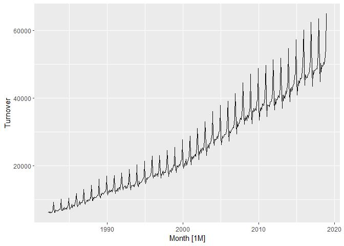

Modelos ARIMA
================
2020-04-20

  - [Estacionariedad y
    diferenciación](#estacionariedad-y-diferenciación)
      - [Diferenciación](#diferenciación)
      - [Diferenciación de segundo
        orden](#diferenciación-de-segundo-orden)
      - [Diferenciación estacional](#diferenciación-estacional)
      - [Pruebas de raíz unitaria](#pruebas-de-raíz-unitaria)

``` r
library(easypackages)
libraries("tidyverse","fpp3", "patchwork")
```

Los modelos ARIMA son otra metodología para realizar pronósticos de
series de tiempo. Estos y los modelos de suavización exponencial son los
métodos más comúnmente utilizados para pronóstico hoy en día.

Una diferencia fundamental entre la suavización exponencial y los
modelos ARIMA es que, en los primeros nos enfocamos en **la forma de la
tendencia y estacionalidad**, mientras que en los modelos ARIMA
pretendemos describir las **autocorrelaciones en los datos**.

# Estacionariedad y diferenciación

Una serie de tiempo **estacionaria** es aquella en la cual sus
propiedades no dependen del tiempo en que son medidas. Por lo tanto, una
serie con tendencia y/o estacionalidad no es estacionaria.

Sin embargo, una serie con un comportamiento cíclico sí es estacionaria,
ya que la ciclicidad no es de un periodo de tiempo fijo.

En general, una serie de tiempo estacionaria no tendrá patrones
predecibles en el largo plazo. Gráficas de tiempo de series
estacionarias mostrarán series horizontales (con o sin ciclos), y con
una **varianza constante**.

¿Cuáles de las siguientes series son estacionarias?

    ## Registered S3 method overwritten by 'quantmod':
    ##   method            from
    ##   as.zoo.data.frame zoo

<!-- -->

  - Las series(a) y (d) presentan una tendencia (creciente y
    decreciente, respectivamente), por lo que **no** pueden ser
    **estacionarias**.

  - Las series (c) y (f) muestran un componente estacional marcado, por
    lo que **no** pueden ser **estacionarias**.

  - La serie (b) sí parece ser **estacionaria**. También muestra que hay
    un outlier en los datos.

  - La serie (e) pareciera tener un patrón estacional. Sin embargo, al
    observarla detalladamente, vemos que el comportamiento cíclico no
    tiene una periodicidad fija, por lo que no es estacionalidad. Esta
    serie también es **estacionaria**.

### Diferenciación

Si observamos las gráficas anteriores, vemos que el precio de la acción
de Google es no estacionario, mientras que los cambios diarios en el
precio de la acción sí lo son. Así, encontramos que *una manera de
convertir una serie en estacionaria es calculando las diferencias entre
observaciones consecutivas*. A esto se le llama **diferenciar** la
serie.

\[y_{t}^{\prime}=y_{t}-y_{t-1}\]

Los datos en primeras diferencias tendrán \(T - 1\) observaciones,
porque no es posible calcular la diferencia para la primera observación.

  - Las transformaciones logarítmicas pueden ayudar a **estabilizar la
    varianza** de una serie.

  - La diferenciación puede ayudar a **estabilizar la media** de una
    serie de tiempo, al quitar los cambios de nivel en ella y reducir o
    eliminar tendencia o estacionalidad.

Otra forma de determinar gráficamente si una serie de tiempo es
estacionaria o no, es viendo su función de autocorrelación, ACF. Para
una serie de tiempo estacionaria, la ACF se vuelve cero rápidamente,
mientras que una serie no estacionaria decae lentamente y el valor del
primer rezago es muy alto y positivo.

``` r
google_2015 %>% ACF(Close) %>% autoplot() | 
  google_2015 %>% ACF(diff_close) %>% autoplot()
```

<!-- -->

Como habíamos visto, la significancia de las autocorrelaciones puede
probarse mediante los estadísticos de Ljung-Box o Box-Pierce:

``` r
google_2015 %>%
  features(diff_close, ljung_box, lag = 10)
```

    ## # A tibble: 1 x 3
    ##   Symbol lb_stat lb_pvalue
    ##   <chr>    <dbl>     <dbl>
    ## 1 GOOG      7.95     0.634

La prueba indica que no son significativas las autocorrelaciones en la
serie diferenciada.

### Diferenciación de segundo orden

A veces, la serie diferenciada parecerá seguir siendo no estacionaria,
por lo que se puede recurrir a las **segundas diferencias**. Esto es,
diferenciar las primeras diferencias:

\[\begin{aligned}
y_{t}^{\prime \prime} &=y_{t}^{\prime}-y_{t-1}^{\prime} \\
&=\left(y_{t}-y_{t-1}\right)-\left(y_{t-1}-y_{t-2}\right) \\
&=y_{t}-2 y_{t-1}+y_{t-2}
\end{aligned}\]

La serie en segundas diferencias tendrá \(T-2\) observaciones. La
interpretacion de \(y_{t}^{\prime \prime}\) es que representa *los
cambios en los cambios* de la serie.

**NOTA:** *En la práctica, casi nunca se requerirá ir más allá de las
segundas diferencias, para lograr estacionariedad en la serie.*

### Diferenciación estacional

Este tipo de diferenciación es la diferencia que existe entre una
observación y la observación previa, de la misma estación:

\[y_{t}^{\prime}=y_{t}-y_{t-m}\]

donde \(m\) es el número de estaciones. También se le conoce como
“lag-\(m\) differences”.

A veces, es necesario tomar diferencias estacionales y primeras
diferencias, para lograr que la serie se convierta en estacionaria. P.
ej., tomemos las ventas de medicamentos corticosteroides.

1.  Se transforma logarítmicamente la serie.
2.  Se sacan las diferencias estacionales.
3.  Como todavía parecen un poco no estacionarias, se obtienen los
    cambios en las ventas (primeras diferencias).

<!-- end list -->

``` r
PBS %>%
  filter(ATC2 == "H02") %>%
  summarise(Cost = sum(Cost)/1e6) %>%
  transmute(
    `Sales ($million)` = Cost,
    `Log sales` = log(Cost),
    `Annual change in log sales` = difference(log(Cost), 12),
    `Doubly differenced log sales` = difference(difference(log(Cost), 12), 1)
  ) %>%
  gather("Type", "Sales", !!!syms(measured_vars(.)), factor_key = TRUE) %>%
  ggplot(aes(x = Month, y = Sales)) +
  geom_line() +
  facet_grid(vars(Type), scales = "free_y") +
  labs(title = "Corticosteroid drug sales", x = "Year", y = NULL)
```

<!-- --> **NOTA:**
*El orden en que se realiza la diferenciación no afecta el resultado (P.
ej. primero realizar la diferenciación estacional y luego las primeras
diferencias o al revés).* Sin embargo, si los datos tienen un componente
estacional bien marcado, se recomienda realizar primero la
diferenciación estacional, ya que la serie puede volverse estacionaria
solo con esa diferenciación.

En la práctica, algún analista pudo haber concluido que la serie con
diferencias estacionales ya era estacionaria, mientras que otro pudo
haber obtenido también las primeras diferencias.

Cuando se realiza la diferenciación, es importante que esta sea
interpretable:

  - Las primeras diferencias son los cambios de una observación a la
    siguiente.
  - Las diferencias estacionales son los cambios de un año a otro.

No se recomienda utilizar otro rezago (p. ej. los cambios entre la
primera y décimo octava observación, ya que es difícil encontrarle una
interpretación lógica).

### Pruebas de raíz unitaria

Para poder determinar más formalmente si una serie es estacionaria o no,
se pueden llevar a cabo pruebas de **raíz unitaria**.

Existen muchas pruebas distintas de raíz unitaria. Utilizaremos, por lo
pronto la prueba propuesta por *Kwiatkowski-Phillips-Schmidt-Shin*, o
prueba KPSS en corto. Aquí, la \(H_0\) es que la serie es estacionaria.
Por lo tanto, un *p-value* alto indicará que sí es estacionaria,
mientras que un *p-value* \(<\alpha\) indicará que la serie no es
estacionaria.

Entonces, el precio de la acción de Google es no estacionario de acuerdo
a la prueba KPSS:

``` r
google_2015 %>%
  features(Close, unitroot_kpss)
```

    ## # A tibble: 1 x 3
    ##   Symbol kpss_stat kpss_pvalue
    ##   <chr>      <dbl>       <dbl>
    ## 1 GOOG        3.56        0.01

mientras que las primeras diferencias sí lo son:

``` r
google_2015 %>%
  features(diff_close, unitroot_kpss)
```

    ## # A tibble: 1 x 3
    ##   Symbol kpss_stat kpss_pvalue
    ##   <chr>      <dbl>       <dbl>
    ## 1 GOOG       0.102         0.1

Podemos utilizar la función `unitroot_ndiffs()` para encontrar el orden
de diferenciación necesario para convertir la serie en estacionaria:

``` r
google_2015 %>%
  features(Close, unitroot_ndiffs)
```

    ## # A tibble: 1 x 2
    ##   Symbol ndiffs
    ##   <chr>   <int>
    ## 1 GOOG        1

Tal como lo habíamos visto, esto nos indica que se requieren las
primeras diferencias para convertir la serie en estacionaria.

Una característica similar para determinar si se requiere diferenciación
estacional se puede obtener con `unitroot_nsdiffs()`.

Tomemos el ejemplo de las ventas minoristas:

``` r
aus_total_retail <- aus_retail %>%
  summarise(Turnover = sum(Turnover))
autoplot(aus_total_retail)
```

    ## Plot variable not specified, automatically selected `.vars = Turnover`

<!-- --> Se puede
ver que la serie en niveles no es estacionaria: tiene una tendencia
creciente y una estacionalidad fuerte. La varianza de la serie ha ido
creciendo, por lo que sacamos los logaritmos primero para estabilizarla.

``` r
aus_total_retail <- aus_total_retail %>%
  mutate(log_turnover = log(Turnover)) 

aus_total_retail %>% autoplot(log_turnover)
```

<!-- --> La
transformación logarítmica fue adecuada para estabilizar la varianza de
esta serie.

Vemos el orden de diferenciación estacional:

``` r
aus_total_retail %>%
  features(log_turnover, unitroot_nsdiffs)
```

    ## # A tibble: 1 x 1
    ##   nsdiffs
    ##     <int>
    ## 1       1

La prueba nos indica que se requiere una diferenciación estacional.
Revisamos si, adicionalmente, se necesitan sacar las primeras
diferencias:

``` r
aus_total_retail %>%
  mutate(log_turnover = difference(log(Turnover), 12)) %>%
  features(log_turnover, unitroot_ndiffs)
```

    ## # A tibble: 1 x 1
    ##   ndiffs
    ##    <int>
    ## 1      1

Así, estas funciones nos indican que se requieren ambas: una
diferenciación estacional y las primeras diferencias para hacer la serie
estacionaria.
