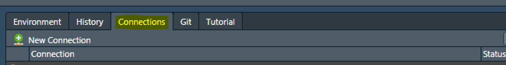
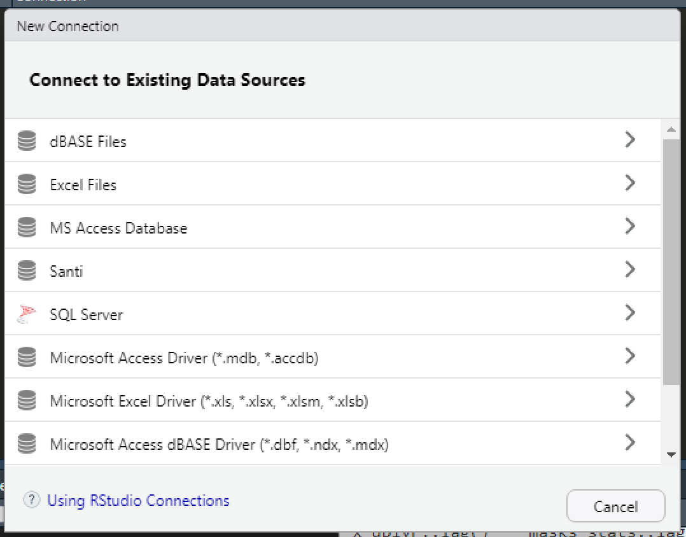
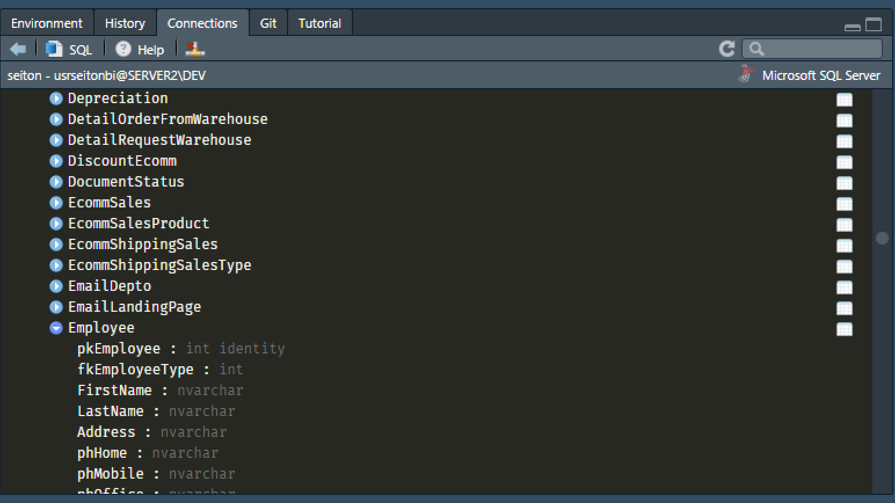

```{css CSS styles, echo=FALSE}
code {
  background-color: rgba(105, 105, 105,0.5);
}
h1 {
  color: aquamarine !important
}
h2 {
  color: deepskyblue !important
}
h3 {
  color: tomato !important
}
```


# Prerequisites

For this course, you will need to download R and RStudio. One way to get R is to go to [CRAN](https://cloud.r-project.org/) (the **C**omprehensive **R** archive **N**etwork).

{width=15%}

RStudio is the IDE (integrated development environment) we'll be using. You can download it from http://www.rstudio.com/download. 

We will also use the `patchwork` package to easily arrange many plots into one single figure.

# What is the tidyverse? {#tidyverse}

"The [`tidyverse`](https://www.tidyverse.org/) is an opinionated collection of R packages designed for data science. All packages share an underlying design philosophy, grammar, and data structures."

These packages help you import, tidy and understand data, to finally be able to communicate your findings in an easy way.

You can install the core packages from the `tidyverse` by simply typing `install.packages("tidyverse")` in the console.

```{r install tidyverse, eval=FALSE}
# You only need to install a package once per device
install.packages("tidyverse")
```

The core `tidyverse` packages (`ggplot2`, `tibble`, `tidyr`, `readr`, `dplyr`, `stringr`, `forcats`, `purrr`) can be loaded then with the `library()` function.

There are many other packages that comply with the `tidyverse` data structure and practices that have to be installed and loaded independently. Some of those that we'll be using throughout the course are `tidymodels` and a tidy ecosystem called [`tidyverts`](https://tidyverts.org/), specifically designed to provide tidy tools for time series analysis, which comprises of three main packages: `tsibble`, `feasts` and `fable`.

```{r pkgs}
library(tidyverse)
library(lubridate)
library(tsibble)
library(feasts)
library(fable)
library(patchwork)
library(tsibbledata)
```


So, how does each of these packages help us tackle our data science problems?

# Data science workflow {#workflow .tabset .tabset-fade}

We can say that a data science workflow (aimed at forecasting) comprises the following general steps:

## 1. Import data {.tabset .tabset-pills}

Data can be imported into R in many ways. The easiest way is importing files, such as .csv, .txt or MS Excel files. However, you can also import files from other statistical softwares or even connect RStudio to a database, such as SQL.

### File importing

We have available different tidyverse-friendly packages to import specific files in your device. Usually, the object which the data gets imported to is a [`tibble`](https://tibble.tidyverse.org/).

{width=15%}

`Tibbles` are the new `data.frame`, that have many advantages over their predecessor, such as a convenient `print()` method that doesn't fill up your console, they don't change variable types or names, among other things. You can learn more about tibbles [here](https://r4ds.had.co.nz/tibbles.html).

{width=15%}

  * The [`readr`](https://readr.tidyverse.org/) package has many functions, like `read_csv()` or `read_delim()`, which allow us to import .csv, .txt, tab separated values, etc. It has functions to export data as well (`write_csv()`, for example).

{width=15%}
    
  * If your data is stored in Excel files (.xls or .xlsx), you can use the functions from [`readxl`](https://readxl.tidyverse.org/).

{width=15%}    
  * The [`haven`](https://haven.tidyverse.org/) package lets you load data from other statistical packages, such as SPSS, Stata and SAS.
  
### Database connection

As said before, you can also connect your RStudio directly to a database. It's straightforward to do so directly in RStudio's IDE, just follow these simple steps:

1. Go to the "**Connections**" tab and click on **"New Connection"**.

{width=90%}

2. A pop-up window will appear, prompting you to select your desired source.

{width=60%}

3. Follow the directions on screen and you're good to go. You can always click the "Help" button for assistance. If everything went ok, you should be able to see all the tables contained in that DB.

{width=70%}

<br>

## 2. Tidy data {#tidy}

All the `tidyverse` packages rely on having tidy data to work with. But, how can we know if our data is truly tidy? As pointed [here](https://tidyr.tidyverse.org/articles/tidy-data.html), we need to know what **values, variables and observations** are and have them arranged the right way.
  
  * **Values** can be quantitative or qualitative.
    
  * A **variable** is a collection of *values* that measure the same attribute (sales, price, temperature, time).
    
  * An **observation** contains all the values measured from all variables in a single unit (a country, a day, a person, a company).
    
So, now, to consider our data as **tidy** [@Wickham2014], we must ensure that:
    
  i) Every column is one variable (and only one).
    
  ii) Every row is just one observation.
    
  iii) Every cell is a single value.

{width=15%}

The [`tidyr`](https://tidyr.tidyverse.org/) package can help us achieve this by:

*   **reshaping** data by pivotting (`pivot_longer()` or `pivot_wider()`),

*   **rectangling**, which can handle nested data (such as JSON files) into tidy tibbles (`unnest_longer()` or `unnest_wider()`), 

*   **filling missing values**, by replacing them (`replace_na()`), dropping such observations (`drop_na()`), or filling with the previous or next values (`fill()`),

* **splitting and combining character columns** (`separate()` and `unite()`), among many other things.

{width=15%}

The [`tsibble`](https://tsibble.tidyverts.org/) package is the foundation for the `tidyverts`. It provides a data infrastructure (a `tsibble`), which is data- and model-oriented object, where you have:

* An **index**, which is the temporal variable that sets the ordering mechanism.

* A **key**, that is a set of variables that define observational units over time.

This way, every observation is uniquely identified by index and key. Also, if the time series is regularly spaced, every observational unit should be measured with a common **interval**.


## 3. Understand your data {#understand .tabset .tabset-pills}

In order to properly understand our data, we might need to **transform** it, **visualize** it, and then **model** it.


### Data transformation {#data_transformation}

{width=15%}

The [`dplyr`](https://dplyr.tidyverse.org/) package contains functions specifically designed to help you transform tidy data. You can add new variables (`mutate()`), choose specific variables (`select()`), pick observations by their values (`filter()`) or by their position or index in the table (`slice()`), sort observations (`arrange`).

You can also group your data (group sales by store: `group_by(data, store)`).

{width=15%}

Whenever you want to manipulate character variables, the [`stringr`](https://stringr.tidyverse.org/) package is a great way to deal with the matter. Conveniently, all the `stringr` functions start with `str_`. Some of the things you can do with it are:

* **Detect matches**, get the index where the pattern is found, count occurences or locate the position of the pattern within the string (`str_detect()`, ``str_which()`, `str_count()`, `str_locate()`).

* **Subset strings**, by extracting substrings from vectors (`str_sub()`), subsetting a tibble to return only the observations that have the pattern (`str_subset()`), extract the string pattern (`str_extract()`)...

* **Manage lengths** (`str_length()`, `str_pad()`, `str_trunc()`, `str_trim()`),

* **Mutate, join and split** strings, (`str_replace()`, `str_to_lower()`, `str_c()`).

{width=15%}

Categorical variables, or **Factors**, as they're called in **R** can be manipulated with the [`forcats`](https://forcats.tidyverse.org/) package.

You can have either ordered factors, or unordered factors, and some functions that would help you handle them would be:

* `fct_reorder()`, using another variable to specify the new order.

* `fct_infreq()`, to order ir according to the frequency of values.

* `fct_relevel()`, to manually choose the order.

* `fct_lump()`, to collapse the least values of a factor into "other" category.


{width=15%}


Handling date-time variables in R can be challenging with base R. Fortunately, the [`lubridate`](https://lubridate.tidyverse.org/) package is here for you.

For example, if you import an Excel sheet with a date variable on it, it will be parsed as character. You need to convert it to a date (or date-time) variable, in order to make calculations, plots, or anything relevant with it.

There are some very intuitive parsing functions to help you out, such as `ymd()` for dates stored with the order year month date (it can handle many formats such as "YYYY-MM-DD", "YYYY/MM/DD", "YYYY MM DD", etc.), `dmy()` for cases when the day comes first, followed by month and year ("DD-MM-YYYY"). Date-time objects can also be parsed with `ymd_hms()`, `ymd_h()`, `dmy_hm()`, `hms()` just to mention a few. 

<br>

<font size="5"> Proceed to [Visualization](#understand) </font> 


### Visualization {#visualization}

<br>

Base **R** plots and graphs are very basic (sometimes even ugly):

```{r base r plot, echo=TRUE}
plot(data = mpg, hwy ~ displ)
```

{width=15%}

Luckily, the [`ggplot2`](https://ggplot2.tidyverse.org/) package can produce astonishing plots and figures conveniently. It relies on the "Grammar of Graphics", where you:

* provide the data,

* specify how you want to map the variables to aesthetics,

* what type of plot or graph you want to produce

* any other customization you'd like,

and `ggplot2` takes care of it.

```{r basic ggplot, fig.align='center'}
ggplot(mpg, aes(displ, hwy)) + 
  geom_point()
```

So, to generally describe how a `ggplot2` plot works is as follows:

1. Start with a `ggplot()` object, where you specify the data to be used,

2. supply the aesthetic mapping (with `aes()`),

3. add on layers:
    * If you want a scatterplot, use `geom_point()`, histogram `geom_hist()`. Other common plots are `geom_line()`, `geom_bar()`, `geom_boxplot()`.
    * define color scales, such as `scale_color_brewer()` or `scale_color_distiller()`,
    * faceting specifications `facet_wrap()` or `facet_grid()`
    * coordinate systems, such as `coord_cartesian()`, `coord_flip()`

Every element is separated with a plus sign (**+**):

```{r custom ggplot, fig.align='center', fig.width=8}
ggplot(mpg, aes(displ, hwy, colour = class)) +
  geom_point() +
  facet_wrap(~manufacturer)
```

It's important to mention that the aesthetics can be passed inside the `ggplot()` function, or within a graphic primitive. In the former, the aesthetics are the same for all the layers, whereas in the latter, the aesthetics passed to a specific layer only affect that layer.

```{r ggplot aes, warning=FALSE, message=FALSE, fig.align='center'}
ggplot(mpg, aes(displ, hwy)) +
  geom_point(aes(color = class)) +
  geom_smooth()

ggplot(mpg, aes(displ, hwy,color = class)) +
  geom_point() +
  geom_smooth()
```


We could not cover all the different variants that can be achieved with `ggplot2` here, even if we tried.

<br>

<font size="5"> Continue to [Exploratory Data Analysis](#understand) </font> 

### Exploratory Data Analysis {#EDA}

Visually inspecting your data can give you insight to their dynamics, patterns, and historic behavior. However, before going into the modelling phase of the analysis, we must perform the **exploratory data analysis (EDA)**.[@Wickham2016]

EDA involves making hypothesis regarding your data, transform and visually inspect statistical properties of it.

Some of the most important things to note on the EDA process are:

* What type of variation do each variable have?

* What is the covariation between variables?

* Are there outliers present in the data?

* What type of distribution do the variables follow?

Some examples

For categorical variables (factors), we can use a bar chart:
```{r barplot}
ggplot(data = diamonds) +
  geom_bar(mapping = aes(x = cut)) +
  ggtitle("Count of Diamonds by cut quality")
```

For continuous variables, a histogram can be used:

```{r hist}
ggplot(data = diamonds) +
  geom_histogram(mapping = aes(x = carat), binwidth = 0.5) +
  ggtitle("Histogram of carats")
```

If you want to analyze the histogram of multiple variables in one single plot, you can use `geom_freqpoly()` or use facetting:

```{r freqpoly}
ggplot(data = diamonds %>% filter(carat < 3), mapping = aes(x = carat, colour = cut)) +
  geom_freqpoly(binwidth = 0.1)
```

```{r hist + facet}
ggplot(data = diamonds %>% filter(carat < 3), mapping = aes(x = carat, fill = cut)) +
  geom_histogram(binwidth = 0.1) +
  facet_wrap(~ cut) +
  theme(legend.position = "none")
```

Choosing the binwidth of the histogram can tell different stories or can reveal different patterns:

```{r hist binwidth, fig.width=8,fig.height=8}
g <- ggplot(data = diamonds %>% filter(carat < 3), mapping = aes(x = carat))
g0 <- g + geom_histogram(binwidth = 0.5) +
  ggtitle("Binwidth = 0.5")
g1 <- g + geom_histogram(binwidth = 0.1) +
  ggtitle("Binwidth = 0.1")
g2 <- g + geom_histogram(binwidth = 0.01) +
  ggtitle("Binwidth = 0.01")
g3 <- g0/g1/g2
g3 + plot_annotation(title = "Histograms varying the binwidth",
                     subtitle = "Different patterns can arise when selecting different binwidths")
```

Another option is to go with boxplots:

```{r boxplot}
ggplot(data = mpg) +
  geom_boxplot(mapping = aes(x = reorder(class, hwy, FUN = median), y = hwy))+ labs(x = "class", y = "hwy mpg")
```


Again, these are just some examples, but the list of  goes on and on.

{width=15%}

Regarding time series analysis, the [`feasts`](https://feasts.tidyverts.org/) package (**F**eature **E**xtraction and **S**tatistics for **T**ime **S**eries) has many functions that makes it easy for us to get further insight into our time series, We can get many graphs from it, such as:

```{r season plot}
aus_production %>% gg_season(Beer)
```

```{r lag plot}
aus_production %>% filter(year(Quarter) > 1991) %>% gg_lag(Beer)
```

```{r stl decomp}
aus_production %>%
  model(STL(Beer ~ season(window = "periodic"))) %>% 
components() %>% 
  autoplot()
```

We can also get statistics from this package:

```{r stl features}
aus_retail %>%
  features(Turnover, feat_stl)
```


<br>

<font size="5"> Go to [Model](#workflow) </font> 

### Model

Whenever we try to model a variable or phenomenom, it is said that we are trying to get a simplified version of reality. In fact, it's simpler than that. What we are really trying to do is understand the way a variable or set of variables change, while ignoring or eliminating external "noise".

It is well known to most data scientists that **you cannot use the same data for modelling and testing (or forecasting)**. That's way many people split their data into a training and testing set. However, a true data scientist has to be even stricter on its use of data:

It is recommended that you split your data into three sets:

<style>
div.aquamarine { background-color: aquamarine; border-radius: 5px; padding: 20px; color: black}
</style>
<div class = "aquamarine">

**1.** ~ 60% of your data goes to the **training** set. Here, you can visualize it, perform all the model fitting and tweaking you want, over and over again.

**2.** ~ 20% of your data should go to a **query** set. With this query set, you can compare models by hand and visualize the outcomes.

**3.** The ~ 20%  remaining data would conform the **test** set. Once you've compared all your models with the training and/or query sets, you can test your final model. This test can only be performed **ONCE**. This ensures no bias is introduced in the model and it remains a true forecast.

</div>

<br>

We will go through many different models aimed to provide forecasts for different situations.


The family of models we will be studying throughout the course are the following:

1. Time series linear models (TSLM).
2. Decomposition models.
3. Exponential smoothing (ETS).
4. ARIMA.
5. Dynamic regression models.
6. Introduction to `tidymodels`.

There are many ways to train models in **R**. As we said before, we will be using primarily two packages for this:

{width=15%}

* Whitin the `tidyverts`, we will use the [`fable`](https://fable.tidyverts.org/) package, which has many univariate and multivariate time series forecasting models. The way to fit one or more models in the `fable` package is by specifying them in the `model()` function.[@Hyndman2019]

```{r model}
fit <- aus_retail %>%
  filter(
    State %in% c("New South Wales", "Victoria"),
    Industry == "Department stores"
  ) %>% 
  model(
    ets = ETS(box_cox(Turnover, 0.3)),
    arima = ARIMA(log(Turnover)),
    snaive = SNAIVE(Turnover)
  )
fit
# A mable: 2 x 5
# Key:     State, Industry [2]
#   State           Industry          ets          arima                   snaive 
#   <chr>           <chr>             <model>      <model>                 <model>
# 1 New South Wales Department stores <ETS(A,Ad,A~ <ARIMA(2,1,1)(2,1,1)[1~ <SNAIV~
# 2 Victoria        Department stores <ETS(A,A,A)> <ARIMA(2,1,1)(1,1,2)[1~ <SNAIV~
```

This produces a `mable` (a model table), where every cell is a fitted model.

Using the `report()` function, you can get a detailed view of a particular model.

```{r report}
fit %>% 
  filter(State == "Victoria") %>% 
  select(State,Industry,arima) %>% 
  report()
```


You could use the `tidy()` function to retrieve each model's terms, estimates and statistics in a tidy way.

```{r tidy report}
tidy(fit)
```


```{r residuals}
fit %>%
  filter(State == "Victoria") %>% 
  select(State,Industry,arima) %>%
  gg_tsresiduals() + ggtitle("Residual Diagnostics for the ARIMA model fitted to Victoria")
```

With the `glance()` function we can get further information for every model fitted.

```{r model fit}
glance(fit)
```


  
<br>

<font size="5"> Go to [Forecasting](#workflow) </font> 

## 4. Forecasting {#focst}

{width=15%}

Once we have trained one or more models that have a proper fit to our training data, we can now go ahead and produce forecasts. Using `fable` is as simple as running the `forecast()` function to our `mable`. It's also quite easy to get plots from it:

```{r forecast, fig.height=8, fig.width=8}
fcst <- fit %>% 
  forecast(h = "2 years") 
fcst
fcst %>% 
  autoplot(filter(aus_retail, year(Month) > 2010), level = NULL) + 
  ggtitle("Forecast comparison across models and time series")
fcst %>% 
  filter(.model =="ets") %>% 
  autoplot(filter(aus_retail, year(Month) > 2010)) + 
  ggtitle("Forecast (with prediction intervals) for the ETS model")
```


## 5. Communicate

The last step of the workflow is to communicate your findings. This can be done in many different ways, depending on your target audience:

{width=15%}

* If you want to present results to your company and produce a reproducible tool that can be use in production, you could make a [`Shiny`](https://shiny.rstudio.com/) app.

{width=15%}

[`R Markdown`](https://rmarkdown.rstudio.com/) documents (just as the one you're reading right now) are a way to make data science reports that join code, outputs and narrative. Given that it's based on markdown, you can write $\LaTeX$ equations, and so on.

$$
\int_{0}^{\infty} e^{-s \cdot t} f(t) d t=\lim _{h \rightarrow \infty} \int_{0}^{h} e^{-s, t} f(t) d t
$$

* If you want to publish your findings for the scientific community, you could write a paper.

* You could also publish it online for anyone to access it.


## Programming

In practice, you could automate the forecasting workflow by defining functions and iterations. The complete code that generates our analysis, from importing data, all the way to communicating your findings is a **program**.

{width=15%}

The [`purrr`](https://purrr.tidyverse.org/) package is an upgrade to R's functional programming toolkit.

{width=15%}

If you're familiar with base **R** programming, you might have wondered about the ` %>% ` operator used in some of the examples above. ` %>% ` is called the **pipe operator**. It's purpose is a tool to help you express a sequence of functions or operations in a more elegant and understandable way, and when reading code, you could translate ` %>% ` to "then".

For example, if you have and Excel background, you might have had cases where your nested formulas where quite a challenge to understand in the long run, for example:

```
=SI.ERROR(INDICE(Costos[Costo],COINCIDIR("Supplies - Imaging "&[@Modelo],Costos[Group]&Costos[Model],0))*[@[Unidades de imagen totales]],"")
```

The same thing could happen in **R**. For example:

```{r messy code, eval=FALSE}
fit <- model(filter(aus_retail,State %in% c("New South Wales", "Victoria"), Industry == "Department stores"),ets = ETS(box_cox(Turnover, 0.3)), arima = ARIMA(log(Turnover)), snaive = SNAIVE(Turnover))
fit
```

It becomes very complicated to understand what the code is doing and in which order. As a matter of fact, this gives exactly the same result as the code we used in the **Model** section.

```{r, eval=FALSE}
fit <- aus_retail %>%
  filter(
    State %in% c("New South Wales", "Victoria"),
    Industry == "Department stores"
  ) %>% 
  model(
    ets = ETS(box_cox(Turnover, 0.3)),
    arima = ARIMA(log(Turnover)),
    snaive = SNAIVE(Turnover)
  )
```

Reading it with the pipe operator, would be like:

1. Define a variable called "fit".

2. Take the "aus_retail" data; `then`

3. filter it, so that we keep only the states "New South Wales" and "Victoria" and the industry is "Department stores"; `then`

4. Fit the three models: ETS, ARIMA and Seasonal Naïve.

It is not the purpose of this course to go in-depth in functional programming or learning to do tidy iterations, but we may do some examples along the way.

# {-}


<br><br><br><br>

***

# Examples 

Let's put in practice what we've seen so far with some examples.

## A) Forecasting Population

We are tasked with producing forecasts of the rural population as a percentage in Mexico, Brazil and Argentina. We were provided with a dataset downloaded from the World Bank. Let's import the world_bank_pop.csv file using `readr`:

### 1. Import data 

```{r pop data}
pop <- read_csv("./data/world_bank_pop.csv")
pop
# A tibble: 1,056 x 20
#    country indicator `2000` `2001` `2002` `2003`  `2004`  `2005`   `2006`   `2007`
#    <chr>   <chr>      <dbl>  <dbl>  <dbl>  <dbl>   <dbl>   <dbl>    <dbl>    <dbl>
#  1 ABW     SP.URB.T~ 4.24e4 4.30e4 4.37e4 4.42e4 4.47e+4 4.49e+4  4.49e+4  4.47e+4
#  2 ABW     SP.URB.G~ 1.18e0 1.41e0 1.43e0 1.31e0 9.51e-1 4.91e-1 -1.78e-2 -4.35e-1
#  3 ABW     SP.POP.T~ 9.09e4 9.29e4 9.50e4 9.70e4 9.87e+4 1.00e+5  1.01e+5  1.01e+5
#  4 ABW     SP.POP.G~ 2.06e0 2.23e0 2.23e0 2.11e0 1.76e+0 1.30e+0  7.98e-1  3.84e-1
#  5 AFG     SP.URB.T~ 4.44e6 4.65e6 4.89e6 5.16e6 5.43e+6 5.69e+6  5.93e+6  6.15e+6
#  6 AFG     SP.URB.G~ 3.91e0 4.66e0 5.13e0 5.23e0 5.12e+0 4.77e+0  4.12e+0  3.65e+0
#  7 AFG     SP.POP.T~ 2.01e7 2.10e7 2.20e7 2.31e7 2.41e+7 2.51e+7  2.59e+7  2.66e+7
#  8 AFG     SP.POP.G~ 3.49e0 4.25e0 4.72e0 4.82e0 4.47e+0 3.87e+0  3.23e+0  2.76e+0
#  9 AGO     SP.URB.T~ 8.23e6 8.71e6 9.22e6 9.77e6 1.03e+7 1.09e+7  1.15e+7  1.21e+7
# 10 AGO     SP.URB.G~ 5.44e0 5.59e0 5.70e0 5.76e0 5.75e+0 5.69e+0  4.92e+0  4.89e+0
# ... with 1,046 more rows, and 10 more variables: `2008` <dbl>, `2009` <dbl>,
#   `2010` <dbl>, `2011` <dbl>, `2012` <dbl>, `2013` <dbl>, `2014` <dbl>,
#   `2015` <dbl>, `2016` <dbl>, `2017` <dbl>
```

### 2. Tidy data

We can immediately see that our data isn't tidy:

i) Columns do not represent variables (we need to put the years in rows, not columns with `pivot_longer`).

ii) We must put variables in columns (column indicator) with `pivot_wider()`.

iii) We can discard the variables that won't be needed with `select()` in conjunction with `contains()`.

iv) We will rename the variables with `rename()`.

v) We only have total population and urban population and the variables "country" and "year" are character. We must calculate the rural population as a percentage of the total, with `mutate()`. Here, we will also convert the "country" variable to factor using `as_factor()` and the "year" variable to double using `as.integer()`.

vi) There are many countries that aren't needed, so we need to keep only the ones of interest with `filter()`.

vii) The data is a `tibble` object, we need to convert it to a `tsibble` using `as_tsibble()`.

We can do this all in one step using the ` %>% ` (pipe) operator.

```{r pop tidy}
pop_tidy <- pop %>% 
  # i)
  pivot_longer(cols = -c(country, indicator),
               names_to = "year", values_to = "value") %>%
  # ii)
  pivot_wider(names_from = indicator,
              values_from = value) %>% 
  # iii)
  select(country,year,contains("TOTL")) %>% 
  # iv)
  rename(urban_pop = SP.URB.TOTL,total_pop = SP.POP.TOTL) %>% 
  #v)
  mutate(rural_pop_pct = (1 - urban_pop / total_pop)*100,
         country = as_factor(country),
         year = as.integer(year)
         ) %>% 
  # vi)
  filter(country %in% c("MEX","BRA","ARG")) %>% 
  #vii)
  as_tsibble(key = country, index = year)

pop_tidy
# A tsibble: 54 x 5 [1Y]
# Key:       country [3]
#    country  year urban_pop total_pop rural_pop_pct
#    <fct>   <int>     <dbl>     <dbl>         <dbl>
#  1 BRA      2000 142319498 175287587          18.8
#  2 BRA      2001 144961004 177750670          18.4
#  3 BRA      2002 147507656 180151021          18.1
#  4 BRA      2003 150005801 182482149          17.8
#  5 BRA      2004 152448023 184738458          17.5
#  6 BRA      2005 154831127 186917361          17.2
#  7 BRA      2006 157150590 189012412          16.9
#  8 BRA      2007 159407908 191026637          16.6
#  9 BRA      2008 161618007 192979029          16.3
# 10 BRA      2009 163798391 194895996          16.0
# ... with 44 more rows
```

### 3. Understanding the data

With our tidy data, we can proceed with the visualization and EDA. The end result will be the selection of one or more forecasting models.

The `feasts` package provides us with a convenient function `autoplot()` that detects the structure of the `tsibble` and applies a `ggplot` object to the data.

We split our data 
```{r pop plot}
pop_train <- pop_tidy %>% 
  filter(year <= 2009)
pop_query <- pop_tidy %>% 
  filter(year > 2009 & year <= 2013)
pop_train_query <- pop_tidy %>% 
  filter(year <= 2013)
# Total population plot
pop_train %>% 
  autoplot(total_pop) + ggtitle("Total population") + 
  ylab("")
# Rural population
pop_train %>%
  autoplot(rural_pop_pct) + ggtitle("Rural population (%)") + 
  ylab("")
```

The total population has an upward trend for Mexico and Brazil, and it seems fairly constant for Russia.

The rural population seems to be decreasing in all cases, with a steeper slope in both american countries.

We will fit three models to each time series:

* A random walk model with drift.
* A simple TSLM.
* An ETS.

```{r pop model}
pop_fit <- pop_train %>% 
  model(`RW w/ drift` = RW(rural_pop_pct ~ drift()),
        `TSLM w/ trend` = TSLM(rural_pop_pct ~ trend()),
        ETS = ETS(rural_pop_pct ~ error("A") + trend("A") + season("N") )
        )
tidy(pop_fit)
```

### 4. Forecasting

```{r pop fcst, fig.width=10, fig.height=8}
pop_fcst <- pop_fit %>% 
  forecast(h = "4 years") 
pop_fcst %>% 
  autoplot(pop_train_query) +
  facet_grid(cols = vars(.model), rows = vars(country), scales = "free_y") + 
  guides(color = FALSE) +
  ylab("Rural population (%)")
```

We see that the models over estimate the decrease in rural population. We change the ETS model slightly and check if we get better results.

```{r, fig.width=10, fig.height=8}
pop_fit2 <- pop_train %>% 
  model(`RW w/ drift` = RW(rural_pop_pct ~ drift()),
        `TSLM w/ trend` = TSLM(rural_pop_pct ~ trend()),
        ETS = ETS(rural_pop_pct ~ error("A") + trend("Ad") + season("N") )
        )
pop_fcst2 <- pop_fit2 %>% 
  forecast(h = "4 years") 

pop_fcst2 %>% 
  autoplot(pop_train_query) +
  facet_grid(cols = vars(.model), rows = vars(country), scales = "free_y") + 
  guides(color = FALSE) +
  ylab("Rural population (%)")
```

```{r}
accuracy(pop_fcst2,pop_train_query) %>% 
  arrange(country, MAPE)
```

It seems now that we have a better accuracy on our forecast, especially with the ETS model. We will proceed then and make our complete forecast with this ETS model.

```{r, fig.width=6, fig.height=8}
pop_train %>% 
  model(ETS = ETS(rural_pop_pct ~ error("A") + trend("Ad") + season("N") )
        ) %>% 
  forecast(h = "12 years") %>% 
  autoplot(pop_tidy) + 
  geom_vline(xintercept = 2014, linetype ="dashed", color = "red") +
  ylab("Rural population (%)") 
```


***
# References

